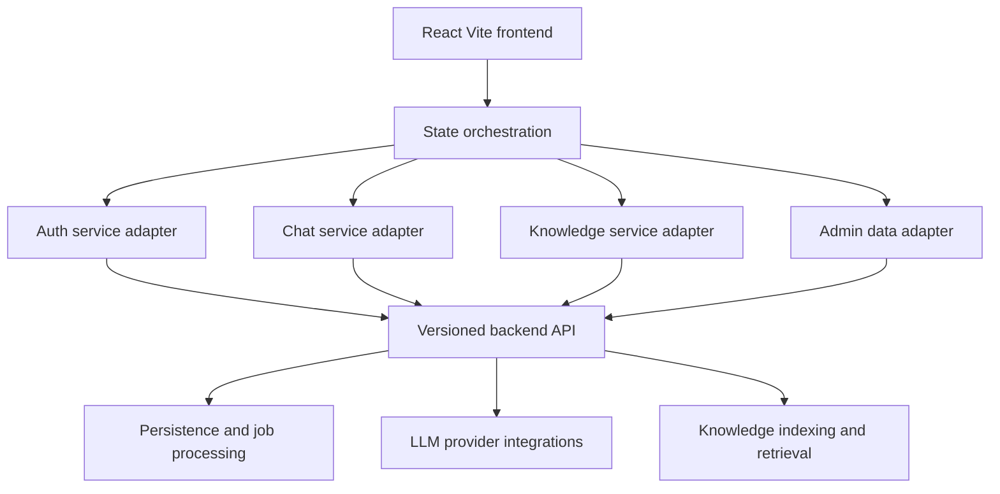
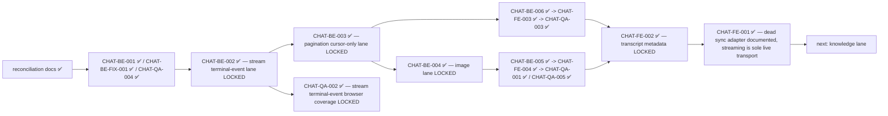

# Dominic System Plan

## System Overview

Dominic is a chat-oriented AI workspace composed of a React and Vite frontend in [`chatbot-ui/`](chatbot-ui), backed by a backend platform that provides authentication, chat orchestration, session persistence, retrieval-enabled knowledge management, and administrative analytics. The repository currently contains the frontend application, but its service layer and documentation clearly indicate integration with an external backend deployed separately. The auth, chat, and core knowledge lifecycle slices have now been source-verified against `../DominicBE` — see the Auth Slice Delta, Chat Slice Delta, and Knowledge Slice Delta sections for verified contracts; some admin analytics contracts remain inferred.

At runtime, the frontend acts as a stateful client for four major domains:
- authentication and session recovery
- conversational chat and session history
- knowledge ingestion, retrieval, and document operations
- administrative controls and reporting

The current frontend architecture suggests a backend that exposes versioned REST APIs under [`API_PREFIX`](chatbot-ui/src/service/apiClient.js:6) with streaming chat support, token refresh, knowledge document pipelines, and admin endpoints.

## Architecture Summary

### Frontend

The frontend application lives in [`chatbot-ui/`](chatbot-ui) and is built with React, Vite, Axios, and Playwright.

Primary frontend responsibilities:
- manage application state in [`App`](chatbot-ui/src/App.jsx:365)
- render the layout shell in [`App()`](chatbot-ui/src/components/App/App.jsx:4)
- persist theme and selected chat model in browser storage
- handle auth token and refresh token lifecycle through [`apiClient`](chatbot-ui/src/service/apiClient.js)
- coordinate chat, knowledge, and admin flows through domain service modules
- validate critical user journeys through end-to-end tests in [`chatbot-ui/tests/e2e/`](chatbot-ui/tests/e2e)

Frontend architectural layers:
- presentation layer: component modules under [`chatbot-ui/src/components/`](chatbot-ui/src/components)
- orchestration layer: stateful container in [`chatbot-ui/src/App.jsx`](chatbot-ui/src/App.jsx)
- configuration layer: model and UI behavior in [`chatbot-ui/src/config/uiConfig.js`](chatbot-ui/src/config/uiConfig.js)
- integration layer: API adapters under [`chatbot-ui/src/service/`](chatbot-ui/src/service)

### Backend

The backend is not present in this repository. Auth, chat, and core knowledge lifecycle contracts have been source-verified against `../DominicBE` (see their respective delta sections); selected admin analytics contracts remain inferred from frontend API usage. The verified + inferred backend responsibilities are:
- issue and refresh access credentials through auth endpoints (verified — see Auth Slice Delta)
- persist users, roles, sessions, and messages (verified for auth/chat/knowledge paths used by this repo)
- execute chat requests against one or more LLM providers (verified for sync/stream contract paths)
- support server-sent event streaming for chat responses (verified)
- manage knowledge documents, chunking, indexing, jobs, search, and lifecycle deletion semantics (verified)
- expose admin analytics, audit logs, and cost reporting (partially inferred; see admin lane)

Verified and inferred backend domains from source usage:
- auth domain via [`authApi`](chatbot-ui/src/service/authApi.js:1) with backend source verification in `../DominicBE`
- chat domain via [`chatApi`](chatbot-ui/src/service/chatApi.js:1) with backend source verification in `../DominicBE`
- knowledge domain via [`knowledgeApi`](chatbot-ui/src/service/knowledgeApi.js:1) with backend source verification for lifecycle and retrieval contracts
- admin analytics domain via [`knowledgeApi`](chatbot-ui/src/service/knowledgeApi.js:1), still partially inferred

### Integration

Integration between frontend and backend is centered on versioned HTTP APIs and browser-managed session state.

Integration characteristics:
- base URL configured through environment variables in [`resolveBaseUrl()`](chatbot-ui/src/service/apiClient.js:8)
- API namespace standardized by [`API_PREFIX`](chatbot-ui/src/service/apiClient.js:6)
- bearer authentication and refresh-token retry managed in [`apiClient.interceptors.response.use()`](chatbot-ui/src/service/apiClient.js:148)
- non-streaming requests handled through Axios service functions
- streaming chat handled through [`sendChatMessageStream()`](chatbot-ui/src/service/chatApi.js:175) with server-sent events
- session-scoped knowledge operations supported by document upload and ingest parameters in [`uploadKnowledgeFile()`](chatbot-ui/src/service/knowledgeApi.js:3) and [`ingestKnowledgeText()`](chatbot-ui/src/service/knowledgeApi.js:17)



## Feature Breakdown

### 1. Authentication and Identity

Observed capabilities:
- register user account and immediately persist auth session tokens
- login with username and password
- restore workspace state from stored auth credentials during app bootstrap
- fetch current user profile for session recovery
- logout through a backend request plus client-side session clear fallback
- refresh access token using stored refresh token across Axios and streaming paths
- change password and reset password via admin-issued reset token
- admin-triggered password reset, role assignment, and user listing

Primary files:
- [`chatbot-ui/src/service/authApi.js`](chatbot-ui/src/service/authApi.js)
- [`chatbot-ui/src/service/apiClient.js`](chatbot-ui/src/service/apiClient.js)
- [`chatbot-ui/src/App.jsx`](chatbot-ui/src/App.jsx)
- [`chatbot-ui/src/components/Login/Login.jsx`](chatbot-ui/src/components/Login/Login.jsx)

### 2. Chat and Session Management

Observed capabilities:
- create, list, select, and delete chat sessions
- retrieve paginated message history for sessions
- submit chat prompts with model and reasoning controls
- stream assistant responses over server-sent events
- include image inputs in chat payloads
- track usage metrics for the signed-in user
- preserve selected model and thinking effort in browser state

Primary files:
- [`chatbot-ui/src/service/chatApi.js`](chatbot-ui/src/service/chatApi.js)
- [`chatbot-ui/src/App.jsx`](chatbot-ui/src/App.jsx)
- [`chatbot-ui/src/components/ChatInput/ChatInput.jsx`](chatbot-ui/src/components/ChatInput/ChatInput.jsx)
- [`chatbot-ui/src/components/ChatWindow/ChatWindow.jsx`](chatbot-ui/src/components/ChatWindow/ChatWindow.jsx)
- [`chatbot-ui/src/components/Sidebar/Sidebar.jsx`](chatbot-ui/src/components/Sidebar/Sidebar.jsx)
- [`chatbot-ui/src/config/uiConfig.js`](chatbot-ui/src/config/uiConfig.js)

### 3. Knowledge Management and Retrieval

Observed capabilities:
- upload knowledge files
- ingest raw text as documents
- scope knowledge to a session or global space
- list documents with filtering
- inspect chunks and ingestion jobs
- search indexed knowledge chunks
- reindex or delete documents
- support async indexing jobs with polling behavior
- attach retrieval context back into chat flows

Primary files:
- [`chatbot-ui/src/service/knowledgeApi.js`](chatbot-ui/src/service/knowledgeApi.js)
- [`chatbot-ui/src/components/KnowledgePanel/KnowledgePanel.jsx`](chatbot-ui/src/components/KnowledgePanel/KnowledgePanel.jsx)
- [`chatbot-ui/src/components/ChatInput/ChatInput.jsx`](chatbot-ui/src/components/ChatInput/ChatInput.jsx)
- [`chatbot-ui/src/App.jsx`](chatbot-ui/src/App.jsx)

### 4. Administration and Observability

Observed capabilities:
- view users
- set user role
- inspect knowledge analytics
- inspect audit logs
- inspect cost metrics
- support admin panel routing within the main application shell

Primary files:
- [`chatbot-ui/src/components/AdminPanel/AdminPanel.jsx`](chatbot-ui/src/components/AdminPanel/AdminPanel.jsx)
- [`chatbot-ui/src/service/authApi.js`](chatbot-ui/src/service/authApi.js)
- [`chatbot-ui/src/service/knowledgeApi.js`](chatbot-ui/src/service/knowledgeApi.js)
- [`chatbot-ui/src/App.jsx`](chatbot-ui/src/App.jsx)

### 5. Testing and Delivery

Observed capabilities:
- build and lint through npm scripts in [`chatbot-ui/package.json`](chatbot-ui/package.json)
- browser-layer end-to-end smoke coverage using Playwright mocks in [`chatbot-ui/tests/e2e/`](chatbot-ui/tests/e2e)
- containerized static deployment via [`chatbot-ui/Dockerfile`](chatbot-ui/Dockerfile) and [`chatbot-ui/nginx.conf`](chatbot-ui/nginx.conf)

## Phase Init Analysis for [`DOC-001`](docs/tasks.json), [`INT-001`](docs/tasks.json), and [`FE-001`](docs/tasks.json)

### Scope and evidence base

This section is limited to analysis and backlog planning for the requested startup phase tasks:
- [`DOC-001`](docs/tasks.json)
- [`INT-001`](docs/tasks.json)
- [`FE-001`](docs/tasks.json)

Verified evidence in this phase-init analysis comes only from these files:
- [`docs/tasks.json`](docs/tasks.json)
- [`docs/plan.md`](docs/plan.md)
- [`README.md`](README.md)
- [`chatbot-ui/README.md`](chatbot-ui/README.md)
- [`chatbot-ui/.env.example`](chatbot-ui/.env.example)
- [`chatbot-ui/src/App.jsx`](chatbot-ui/src/App.jsx)
- [`chatbot-ui/src/components/App/App.jsx`](chatbot-ui/src/components/App/App.jsx)
- [`chatbot-ui/src/service/apiClient.js`](chatbot-ui/src/service/apiClient.js)
- supporting contract evidence from [`chatbot-ui/src/service/authApi.js`](chatbot-ui/src/service/authApi.js), [`chatbot-ui/src/service/chatApi.js`](chatbot-ui/src/service/chatApi.js), and [`chatbot-ui/src/service/knowledgeApi.js`](chatbot-ui/src/service/knowledgeApi.js)

Anything about the backend runtime, persistence model, or infrastructure beyond those files is marked as inferred.

### Current state verified

#### Verified for [`DOC-001`](docs/tasks.json)
- The repository contains a frontend app under [`chatbot-ui/`](chatbot-ui) and does not contain backend source code in the current workspace listing.
- The root documentation explicitly describes this repository as a frontend workspace in [`README.md`](README.md:3).
- The current plan already frames the backend as inferred rather than present in repo in [`docs/plan.md`](docs/plan.md:37).
- Frontend-to-backend interaction is organized around auth, chat, knowledge, and admin-related service adapters in [`chatbot-ui/src/service/authApi.js`](chatbot-ui/src/service/authApi.js:1), [`chatbot-ui/src/service/chatApi.js`](chatbot-ui/src/service/chatApi.js:1), and [`chatbot-ui/src/service/knowledgeApi.js`](chatbot-ui/src/service/knowledgeApi.js:1).

#### Verified for [`INT-001`](docs/tasks.json)
- The API namespace is currently versioned under [`API_PREFIX`](chatbot-ui/src/service/apiClient.js:6) with value `/api/v1`.
- Base URL resolution is environment-driven first via [`VITE_API_BASE_URL`](chatbot-ui/src/service/apiClient.js:9), then falls back to localhost for local hostnames and to a production default otherwise in [`resolveBaseUrl()`](chatbot-ui/src/service/apiClient.js:8).
- Request timeout is controlled by [`VITE_API_TIMEOUT_MS`](chatbot-ui/src/service/apiClient.js:18) and mirrored in [`chatbot-ui/.env.example`](chatbot-ui/.env.example:3).
- Access token and refresh token persistence use browser local storage keys [`dominic.authToken`](chatbot-ui/src/service/apiClient.js:4) and [`dominic.refreshToken`](chatbot-ui/src/service/apiClient.js:5).
- Unauthorized retry behavior is implemented centrally in [`apiClient.interceptors.response.use()`](chatbot-ui/src/service/apiClient.js:148) for Axios requests and separately in [`sendChatMessageStream()`](chatbot-ui/src/service/chatApi.js:175) for streaming fetch requests.
- Auth endpoints verified from service source are `/api/v1/auth/register`, `/api/v1/auth/login`, `/api/v1/auth/refresh`, `/api/v1/auth/logout`, `/api/v1/auth/me`, `/api/v1/auth/change-password`, `/api/v1/auth/reset-password`, `/api/v1/auth/admin/reset-password`, `/api/v1/auth/admin/users`, and `/api/v1/auth/admin/set-role` via [`chatbot-ui/src/service/authApi.js`](chatbot-ui/src/service/authApi.js:3).
- Chat endpoints verified from service source are `/api/v1/chat/`, `/api/v1/chat/stream`, `/api/v1/chat/usage/me`, `/api/v1/chat/sessions`, `/api/v1/chat/sessions/:sessionId/messages`, `/api/v1/chat/sessions/:sessionId`, and rename via PATCH on the same session resource in [`chatbot-ui/src/service/chatApi.js`](chatbot-ui/src/service/chatApi.js:148).
- Knowledge endpoints verified from service source are `/api/v1/knowledge/documents/upload`, `/api/v1/knowledge/documents/ingest`, `/api/v1/knowledge/documents`, `/api/v1/knowledge/documents/:docId`, `/api/v1/knowledge/documents/:docId/chunks`, `/api/v1/knowledge/documents/:docId/jobs`, `/api/v1/knowledge/search`, `/api/v1/knowledge/documents/:docId/reindex`, `/api/v1/knowledge/documents/:docId`, `/api/v1/knowledge/jobs/:jobId`, `/api/v1/knowledge/admin/analytics`, `/api/v1/knowledge/admin/audit-logs`, and `/api/v1/knowledge/admin/cost` in [`chatbot-ui/src/service/knowledgeApi.js`](chatbot-ui/src/service/knowledgeApi.js:3).

#### Verified for [`FE-001`](docs/tasks.json)
- [`App`](chatbot-ui/src/App.jsx:365) is the stateful root orchestration component and owns auth, session, messages, knowledge, admin, loading, theme, usage, and model state through multiple [`useState()`](chatbot-ui/src/App.jsx:371) declarations.
- [`App`](chatbot-ui/src/App.jsx:365) directly imports service-layer functions from auth, chat, knowledge, and API client modules and wires them into UI event handlers.
- [`App`](chatbot-ui/src/App.jsx:1551) decides which workspace content to render based on login state, view state, role state, and transition state.
- [`AppLayout`](chatbot-ui/src/components/App/App.jsx:4) is currently a layout shell that renders [`Sidebar`](chatbot-ui/src/components/App/App.jsx:24) plus a main content slot via `children` in [`chatbot-ui/src/components/App/App.jsx`](chatbot-ui/src/components/App/App.jsx:42).
- The shell does not import service modules and does not own data fetching in [`chatbot-ui/src/components/App/App.jsx`](chatbot-ui/src/components/App/App.jsx:1).
- Within [`App`](chatbot-ui/src/App.jsx:1473), view orchestration dispatches to [`KnowledgePanel`](chatbot-ui/src/App.jsx:1477), [`AdminPanel`](chatbot-ui/src/App.jsx:1501), or the chat pair [`ChatWindow`](chatbot-ui/src/App.jsx:1521) and [`ChatInput`](chatbot-ui/src/App.jsx:1530).

### Verified versus inferred boundary map

#### Verified frontend ownership
- Browser state ownership for auth user, active view, sessions, active session id, messages, pagination, knowledge collections, admin collections, loading flags, theme, usage, selected model, and thinking effort is in [`App`](chatbot-ui/src/App.jsx:371).
- Layout composition ownership for sidebar plus main region is in [`AppLayout`](chatbot-ui/src/components/App/App.jsx:4).
- HTTP client configuration, token storage, auth header injection, timeout, form-data handling, and refresh retry for Axios traffic are in [`apiClient`](chatbot-ui/src/service/apiClient.js:24).
- Domain-specific request construction belongs to service adapters in [`chatbot-ui/src/service/authApi.js`](chatbot-ui/src/service/authApi.js:3), [`chatbot-ui/src/service/chatApi.js`](chatbot-ui/src/service/chatApi.js:3), and [`chatbot-ui/src/service/knowledgeApi.js`](chatbot-ui/src/service/knowledgeApi.js:3).

#### Verified and inferred backend ownership
- Token issuance semantics, refresh token validation, and session invalidation logic are verified against `../DominicBE/app/api/endpoints/auth.py`, `../DominicBE/app/services/auth_service.py`, `../DominicBE/app/crud/crud_auth.py`, and `../DominicBE/app/api/deps.py`. The logout edge case for expired access tokens is **resolved**: AUTH-BE-1 confirmed bearer-only semantics; AUTH-FE-3 implemented and tested the explicit refresh-once + retry-once + local-clear-in-finally flow in [`handleLogout()`](chatbot-ui/src/App.jsx:925). No open auth ambiguity remains in this slice.
- Chat persistence, message ordering, message pagination correctness, and stream event production have been source-verified against `../DominicBE` in the Chat Slice Delta.
- Knowledge document storage, chunking, indexing, job status transitions, retrieval scoring, delete semantics, and retrieval scoping have been source-verified against `../DominicBE` in BE-003 (Knowledge Slice Delta update).
- Admin analytics aggregation, audit event persistence, and cost computation remain partially inferred from [`getKnowledgeAnalytics()`](chatbot-ui/src/service/knowledgeApi.js:81), [`getAuditLogs()`](chatbot-ui/src/service/knowledgeApi.js:106), and [`getCostMetrics()`](chatbot-ui/src/service/knowledgeApi.js:120).

### Drift between docs and source code

#### Confirmed drift in API prefix documentation — resolved by AUTH-DOC-1
- [`README.md`](README.md:43) previously documented backend prefixes as `/api/auth`, `/api/chat`, and `/api/knowledge`.
- [`chatbot-ui/README.md`](chatbot-ui/README.md:11) previously used `/api/auth/*`, `/api/chat/*`, and `/api/knowledge/*`.
- Source code uses versioned routes under [`API_PREFIX`](chatbot-ui/src/service/apiClient.js:6) with `/api/v1`, so the canonical contract is `/api/v1/auth/*`, `/api/v1/chat/*`, and `/api/v1/knowledge/*`.
- Both doc files have been updated to reflect the canonical `/api/v1` namespace and the legacy `/api/*` alias. Drift resolved.

#### Confirmed drift in root README test-status statement — resolved by AUTH-DOC-1
- [`README.md`](README.md:54) previously stated the repo does not yet have browser E2E tests.
- The workspace contains Playwright tests under [`chatbot-ui/tests/e2e/`](chatbot-ui/tests/e2e), and [`chatbot-ui/README.md`](chatbot-ui/README.md:73) now documents the full mocked smoke coverage including session recovery and logout edge cases.
- Drift resolved.

#### Confirmed drift in chat metadata visibility documentation — resolved by CHAT-FE-002

**Decision (CHAT-FE-002): Option 2 — keep the current UI transcript as-is; narrow docs and assumptions to `assistant_meta.display_text` plus expandable sources only.**

- Source only renders [`assistantMeta.display_text`](chatbot-ui/src/components/MessageBubble/MessageBubble.jsx:211) and expandable `sources` in [`MessageBubble`](chatbot-ui/src/components/MessageBubble/MessageBubble.jsx:297); `retrieval` and message-level `usage` are stored on assistant messages in [`App`](chatbot-ui/src/App.jsx:273) and [`App`](chatbot-ui/src/App.jsx:1126) but are not rendered by [`ChatWindow`](chatbot-ui/src/components/ChatWindow/ChatWindow.jsx:184) or [`MessageBubble`](chatbot-ui/src/components/MessageBubble/MessageBubble.jsx:98).
- The drift was in docs/planning only, not in the React runtime. No source code change was required.
- CHAT-FE-002-B: [`README.md`](README.md:9) updated — removed claim about retrieval badge and usage metadata; replaced with accurate wording that transcript renders `assistant_meta.display_text` and expandable sources, and that `retrieval` and message-level `usage` are stored-but-not-rendered.
- CHAT-FE-002-C: [`chatbot-ui/README.md`](chatbot-ui/README.md:22) and [`chatbot-ui/README.md`](chatbot-ui/README.md:142) updated — same narrowing applied to Phase 2 bullet and Ghi chú knowledge base section.
- Drift resolved. [`CHAT-FE-002`](docs/tasks.json) is closed.

#### Confirmed drift in App responsibility description precision
- [`docs/plan.md`](docs/plan.md:23) describes [`App()`](chatbot-ui/src/components/App/App.jsx:4) as the layout shell, which is correct.
- However, current source shows the shell is thinner than the plan implies: it only composes [`Sidebar`](chatbot-ui/src/components/App/App.jsx:24) and `children`, while all view switching and screen-stage routing remain in [`App`](chatbot-ui/src/App.jsx:1438).
- This is not an outright contradiction, but it is an underspecified ownership boundary that should be tightened for [`FE-001`](docs/tasks.json).

#### Confirmed drift in base URL fallback documentation nuance
- [`chatbot-ui/README.md`](chatbot-ui/README.md:30) says the frontend defaults to `http://127.0.0.1:8000`.
- Source actually defaults to localhost only when browser hostname is localhost or `127.0.0.1`, else it falls back to [`DEFAULT_PRODUCTION_API_BASE_URL`](chatbot-ui/src/service/apiClient.js:3).
- [`chatbot-ui/.env.example`](chatbot-ui/.env.example:17) additionally documents a same-host deployment mode by leaving [`VITE_API_BASE_URL`](chatbot-ui/.env.example:17) empty, but current [`resolveBaseUrl()`](chatbot-ui/src/service/apiClient.js:8) does not resolve to same-origin `/api`; it resolves to localhost or a hardcoded production host.
- This is both a doc drift and an integration planning risk for [`INT-001`](docs/tasks.json).

### Architecture conclusions

#### Frontend to backend boundary
- Frontend boundary ends at service-layer request construction plus browser-side session handling in [`chatbot-ui/src/service/apiClient.js`](chatbot-ui/src/service/apiClient.js:24), [`chatbot-ui/src/service/authApi.js`](chatbot-ui/src/service/authApi.js:3), [`chatbot-ui/src/service/chatApi.js`](chatbot-ui/src/service/chatApi.js:148), and [`chatbot-ui/src/service/knowledgeApi.js`](chatbot-ui/src/service/knowledgeApi.js:3).
- Backend boundary starts at versioned HTTP endpoints under `/api/v1` as verified by the service modules.
- Frontend should treat response payload shape, stream event schema, pagination headers, and admin authorization as external contracts rather than UI-owned behavior.

#### Ownership split to lock for [`FE-001`](docs/tasks.json)
- [`App`](chatbot-ui/src/App.jsx:365) owns orchestration: cross-domain state, bootstrapping, auth recovery, role gating, screen transitions, view routing, domain handler composition, and prop assembly for child views.
- [`AppLayout`](chatbot-ui/src/components/App/App.jsx:4) owns shell composition only: sidebar placement, main region framing, and pass-through layout props.
- Service layer owns transport and contract adaptation only: URL assembly, params, headers, payload shaping, pagination header parsing, SSE parsing, and auth retry plumbing in [`chatbot-ui/src/service/apiClient.js`](chatbot-ui/src/service/apiClient.js:148) and [`chatbot-ui/src/service/chatApi.js`](chatbot-ui/src/service/chatApi.js:57).
- Child view components should remain presentation-focused and callback-driven; they should not absorb root auth recovery or API client concerns.

#### Dependency and bottleneck conclusions
- [`App`](chatbot-ui/src/App.jsx:365) is the current coupling hotspot because auth, chat, knowledge, admin, theme, and transition logic all converge there.
- Streaming chat is a special integration path because it bypasses Axios and re-implements auth retry in [`sendChatMessageStream()`](chatbot-ui/src/service/chatApi.js:175), which increases drift risk with [`apiClient.interceptors.response.use()`](chatbot-ui/src/service/apiClient.js:148).
- Admin concerns are split across auth and knowledge service modules, which is workable but blurs domain boundaries for future backend contract work.

### Backlog of next implementation tasks for frontend

#### FE tasks immediately after this phase-init analysis
- FE-A1: document a verified state-domain map for [`App`](chatbot-ui/src/App.jsx:365) covering auth, sessions, messages, knowledge, admin, theme, usage, and model state.
- FE-A2: document the screen-routing matrix in [`App`](chatbot-ui/src/App.jsx:1438) for login, workspace entry, chat, knowledge, and admin states.
- FE-A3: document prop contracts between [`App`](chatbot-ui/src/App.jsx:1551) and [`AppLayout`](chatbot-ui/src/components/App/App.jsx:4), and between [`App`](chatbot-ui/src/App.jsx:1477) and each major view component.
- FE-A4: isolate and catalogue which [`App`](chatbot-ui/src/App.jsx:365) handlers are pure orchestration versus which contain domain normalization that may later belong in hooks or helpers.
- FE-A5: trace model-selection and thinking-effort state from [`App`](chatbot-ui/src/App.jsx:398) into [`chatbot-ui/src/config/uiConfig.js`](chatbot-ui/src/config/uiConfig.js) and the chat input contract.
- FE-A6: trace session-scoped knowledge import handoff from [`ChatInput`](chatbot-ui/src/App.jsx:1530) to knowledge document refresh behavior in [`App`](chatbot-ui/src/App.jsx).
- FE-A7: produce a verified list of UI states requiring regression coverage once implementation begins, especially unauthorized recovery, stream interruption, and admin role gating.

### Backlog of next implementation tasks for backend

#### BE tasks inferred from verified frontend contracts
- BE-A1: align published backend API documentation to the verified `/api/v1` namespace used by frontend service modules.
- BE-A2 ✅ — auth response payload contract confirmed: `login`, `register`, and `refresh` all return `access_token`, `refresh_token`, `success`, `username`, `role`, and `token_type` as required by [`setAuthSession()`](chatbot-ui/src/service/apiClient.js:103). Resolved by AUTH-BE-1.
- BE-A3 ✅ — logout semantics confirmed: server-side invalidation via token-version revocation when the request is authenticated; 401 returned on expired access token without revoke. Frontend handles the edge case explicitly in [`handleLogout()`](chatbot-ui/src/App.jsx:925). Resolved by AUTH-BE-1 and AUTH-FE-3.
- BE-A4: confirm chat streaming event schema consumed by [`consumeSseStream()`](chatbot-ui/src/service/chatApi.js:77), including at least `error` and `final` events and JSON payload behavior.
- BE-A5: confirm message history pagination headers required by [`parseMessagePaginationHeaders()`](chatbot-ui/src/service/chatApi.js:57).
- BE-A6: confirm knowledge document session-scoping semantics for `session_id`, `session_filter`, and global fallback behavior used across [`listKnowledgeDocuments()`](chatbot-ui/src/service/knowledgeApi.js:48), [`uploadKnowledgeFile()`](chatbot-ui/src/service/knowledgeApi.js:3), and [`ingestKnowledgeText()`](chatbot-ui/src/service/knowledgeApi.js:17).
- BE-A7: separate backend ownership docs for admin user-management endpoints under auth and admin analytics endpoints under knowledge-admin routes to prevent cross-domain drift.

### Recommended mode execution order



### Chat lane lock summary (post-CHAT-FE-002 reconciliation batch)

> **Reconciliation batch note (2026-05-08):** CHAT-FE-002 is now fully closed. All chat lanes are source-verified, decision-locked, and regression-covered **except** [`CHAT-FE-001`](docs/tasks.json), which remains `todo`. The claim "all CHAT-* tasks are done" in earlier batch notes was premature — [`CHAT-FE-001`](docs/tasks.json) (dead sync adapter cleanup) was never executed. It is the sole genuinely open chat task before the knowledge lane begins.
>
> **Reconciliation batch note (2026-05-12):** CHAT-FE-001 is now closed. `sendChatMessage()` has been removed from the active FE chat transport surface — no caller exists in `chatbot-ui/src/`; only a tombstone comment remains in `chatApi.js`. Streaming via `sendChatMessageStream()` is confirmed as the sole live FE chat transport. All chat lanes are now fully locked.

| Lane | Decision task | Implementation | Browser coverage | Backend regressions | Status |
|---|---|---|---|---|---|
| **Image** | [`CHAT-BE-004`](docs/tasks.json) ✅ | [`CHAT-BE-005`](docs/tasks.json) ✅ + [`CHAT-FE-004`](docs/tasks.json) ✅ | [`CHAT-QA-001`](docs/tasks.json) ✅ — A/B/C in [`chat.spec.js`](chatbot-ui/tests/e2e/chat.spec.js:462) | [`CHAT-QA-005`](docs/tasks.json) ✅ — 3 tests in [`test_api_regressions.py`](../DominicBE/tests/test_api_regressions.py:490) | 🔒 **Fully locked** |
| **Stream terminal-event** | [`CHAT-BE-002`](docs/tasks.json) ✅ | n/a (decision only) | [`CHAT-QA-002`](docs/tasks.json) ✅ — A/B in [`chat.spec.js`](chatbot-ui/tests/e2e/chat.spec.js:402) | [`CHAT-QA-004`](docs/tasks.json) ✅ | 🔒 **Fully locked** |
| **Pagination cursor-only** | [`CHAT-BE-003`](docs/tasks.json) ✅ | [`CHAT-BE-006`](docs/tasks.json) ✅ + [`CHAT-FE-003`](docs/tasks.json) ✅ | [`CHAT-QA-003`](docs/tasks.json) ✅ — A/B/C in [`chat.spec.js`](chatbot-ui/tests/e2e/chat.spec.js:578) | 4 sub-contract tests in [`test_api_regressions.py`](../DominicBE/tests/test_api_regressions.py:594) | 🔒 **Fully locked** |
| **Transcript metadata** | [`CHAT-FE-002`](docs/tasks.json) ✅ | docs narrowed (no code change) | n/a | n/a | 🔒 **Fully locked** |
| **Dead sync adapter** | n/a | [`CHAT-FE-001`](docs/tasks.json) ✅ done — `sendChatMessage()` removed from active surface; tombstone comment only | n/a | n/a | 🔒 **Fully locked** |

Recommended order (updated after post-CHAT-FE-002 reconciliation batch):
- 1. **Reconciliation docs** ✅ — planning reconciliation batch complete. Task inventory is now drift-free and trackable.
- 2. **[`CHAT-BE-001`](docs/tasks.json) ✅ / [`CHAT-BE-FIX-001`](docs/tasks.json) ✅ / [`CHAT-QA-004`](docs/tasks.json) ✅** — sync `assistant_meta` parity verified in source; bug was falsified (fix already present); [`test_sync_chat_response_includes_assistant_meta`](../DominicBE/tests/test_api_regressions.py:433) passes. No code change needed.
- 3. **[`CHAT-BE-002`](docs/tasks.json) ✅ — stream terminal-event lane LOCKED** — SSE completion policy is now locked: success streams terminate with `final`, failure streams terminate with `error`, and `final` is not guaranteed on failure paths. No backend code change is required for the decision itself.
- 3a. **[`CHAT-QA-002`](docs/tasks.json) ✅ — stream terminal-event browser coverage LOCKED** — stream terminal-event regressions are now locked in [`chatbot-ui/tests/e2e/chat.spec.js`](chatbot-ui/tests/e2e/chat.spec.js:402). `CHAT-QA-002-A` verifies the `error` SSE path terminates without `final` and clears streaming state. `CHAT-QA-002-B` verifies the no-terminal protocol-failure path surfaces a 502-like error and clears streaming state. No production source change was required.
- 4. **[`CHAT-BE-003`](docs/tasks.json) ✅ — pagination cursor-only lane LOCKED** — message-history pagination is now decision-locked: `before_id` is the only canonical public cursor, `skip` is not retained as a public contract, and omitted `limit` returns all messages (unbounded, no artificial cap). No production code change is required for the decision itself.
- 5. **[`CHAT-BE-006`](docs/tasks.json) ✅ + [`CHAT-FE-003`](docs/tasks.json) ✅ + [`CHAT-QA-003`](docs/tasks.json) ✅ — pagination implementation COMPLETE** — backend sub-contract regressions (4 tests) and browser cursor-only regressions (3 tests) are locked. `skip` is removed from the public contract on both FE and BE sides.
- 6. **[`CHAT-BE-004`](docs/tasks.json) ✅ — image lane LOCKED** — canonical chat-image contract is now locked: max 5 images per message, MIME allowlist `image/jpeg|image/png|image/webp|image/gif`, 5 MB per-image runtime default, and non-empty `images` must be rejected when `LLM_VISION_ENABLED=false`.
- 7. **[`CHAT-BE-005`](docs/tasks.json) ✅ + [`CHAT-FE-004`](docs/tasks.json) ✅ + [`CHAT-QA-001`](docs/tasks.json) ✅ + [`CHAT-QA-005`](docs/tasks.json) ✅ — image implementation COMPLETE** — backend enforces 5-image cap, MIME allowlist, and vision-disabled rejection. Frontend restricts file-picker and paste to the four-type allowlist. Browser regressions (3 tests) and backend regressions (3 tests) are locked.
- 8. **[`CHAT-FE-002`](docs/tasks.json) ✅ — transcript metadata lane LOCKED** — decision: keep current UI transcript as-is; narrow docs to `assistant_meta.display_text` plus expandable sources only. `retrieval` and message-level `usage` are stored-but-not-rendered. `README.md` and `chatbot-ui/README.md` updated. No React source change required. **Note:** this step corrects the earlier overclaim that "all CHAT-* tasks are done" — [`CHAT-FE-001`](docs/tasks.json) was not done at that point and remains open.
- 9. **[`CHAT-FE-001`](docs/tasks.json) ✅ — CLOSED: dead sync adapter removed from active surface** — `sendChatMessage()` confirmed to have no caller in `chatbot-ui/src/`; the function has been removed from the active FE chat transport surface and only a tombstone comment remains in [`chatApi.js`](chatbot-ui/src/service/chatApi.js:3). `sendChatMessageStream()` is the sole live FE chat transport. All chat lanes are now fully locked.
- 10. **Next recommended domain: Knowledge lane** — [`INT-003`](docs/tasks.json) ✅, [`BE-003`](docs/tasks.json) ✅, [`FE-004`](docs/tasks.json) ✅ (batch 1 closed), and [`QA-001`](docs/tasks.json) remain. [`FE-006`](docs/tasks.json) ✅ model catalog lane also closed in batch 1.
- 11. Use [`tester`](docs/tasks.json) mode after each implementation batch that changes UI contracts, service behavior, or docs tied to tests.
- 12. Use [`reviewer`](docs/tasks.json) mode after tester validation to audit architecture drift and contract compliance.
- 13. Use [`fixer`](docs/tasks.json) mode only for targeted remediation of issues found by tester and reviewer.

### Phase-init decision summary

#### Verified conclusions
- [`DOC-001`](docs/tasks.json) ✅ — **Complete.** Endpoint namespace drift and E2E test-status drift resolved by AUTH-DOC-1. Canonical `/api/v1` is documented alongside the legacy `/api/*` alias. Frontend ownership and inferred backend responsibilities are described consistently with the repository structure. Chat metadata visibility wording drift resolved by [`CHAT-FE-002`](docs/tasks.json) ✅.
- [`INT-001`](docs/tasks.json) ✅ — **Complete.** Base URL resolution, timeout, token storage, API prefix, and refresh-token retry behavior are all documented. Environment-driven configuration is preserved without hardcoded endpoint expansion. Split retry path between Axios and streaming fetch is captured in the Chat Slice Delta.
- [`FE-001`](docs/tasks.json) ✅ — **Complete.** [`App`](chatbot-ui/src/App.jsx:365) is confirmed as the orchestration boundary owning all cross-domain state; [`AppLayout`](chatbot-ui/src/components/App/App.jsx:4) is confirmed as a thin shell composing Sidebar plus a children slot only. Ownership split is locked.
- [`BE-001`](docs/tasks.json) ✅ — **Complete.** Auth endpoints, payload shapes for login/register/refresh, and server-side logout invalidation are source-verified against `../DominicBE`. `/api/v1` is the canonical frontend namespace; `/api/*` is a legacy compatibility alias. Admin auth operations are listed separately from end-user flows.
- [`FE-002`](docs/tasks.json) ✅ — **Complete.** Login, register, reset-password, logout (normal and expired-access edge), workspace bootstrap, session recovery, and change-password flows are all identified with loading/success/failure states and covered by 12 passing Playwright tests. No open auth E2E gaps remain.
- [`INT-002`](docs/tasks.json) ✅ — **Complete.** Chat payload fields, stream parsing behavior, history-pagination headers, and assistant metadata handling are source-mapped on both frontend and backend. Sync-response parity confirmed (CHAT-BE-001 ✅). SSE completion contract locked (CHAT-BE-002 ✅): success → `final`, failure → `error`, `final` not guaranteed on failure. History-pagination contract locked (CHAT-BE-003 ✅): `before_id` is the canonical cursor, `skip` is not a public contract, omitted `limit` becomes a backend-owned default guarantee. Remaining implementation follow-up is split across [`CHAT-BE-006`](docs/tasks.json), [`CHAT-FE-003`](docs/tasks.json) ✅, and [`CHAT-QA-003`](docs/tasks.json).
- [`BE-002`](docs/tasks.json) ✅ — **Complete.** Backend requirements for chat session creation, listing, deletion, message history retrieval, and assistant message row schema are documented. Pagination header guarantees and streaming event guarantees are defined. Usage, sources, retrieval, assistant_meta, and image payload validation dependencies are captured for backend ownership.
- [`FE-003`](docs/tasks.json) ✅ — **Complete.** Composer responsibilities (prompt entry, model selection, reasoning effort, web search, knowledge-document precedence, image attachment constraints) are identified. Transcript responsibilities distinguish rendered metadata (`assistant_meta.display_text`, `sources`) from stored-but-not-rendered data (`retrieval`, message-level `usage`), plus load-older history behavior. State handoff between root orchestration, chat presentation components, and existing E2E chat coverage is documented.

#### Inferred conclusions
- The near-term auth delivery risk for logout-with-expired-access-token has been resolved: AUTH-BE-1 confirmed the backend contract and AUTH-FE-3 implemented and tested the explicit refresh-once + retry-once flow in [`handleLogout()`](chatbot-ui/src/App.jsx:925). The Playwright auth mock drift has also been resolved by AUTH-FE-1.
- AUTH-FE-4 has been delivered: change-password E2E coverage is complete — success path forces re-login and failure path keeps the account settings surface open with inline feedback. No open auth E2E gaps remain.
- The highest frontend maintainability risk is continued expansion of [`App`](chatbot-ui/src/App.jsx:365) without first freezing explicit ownership boundaries.

## Auth Slice Delta for [`BE-001`](docs/tasks.json) and [`FE-002`](docs/tasks.json)

### Scope and evidence update
- This delta extends the earlier frontend-only startup analysis with verified auth evidence from `../DominicBE/app/main.py`, `../DominicBE/app/api/endpoints/auth.py`, `../DominicBE/app/schemas/auth_schemas.py`, `../DominicBE/app/services/auth_service.py`, `../DominicBE/app/crud/crud_auth.py`, `../DominicBE/app/api/deps.py`, and `../DominicBE/tests/test_api_regressions.py`.
- Frontend auth-flow evidence is taken from [`chatbot-ui/src/components/Login/Login.jsx`](chatbot-ui/src/components/Login/Login.jsx), [`chatbot-ui/src/App.jsx`](chatbot-ui/src/App.jsx), [`chatbot-ui/src/components/Sidebar/Sidebar.jsx`](chatbot-ui/src/components/Sidebar/Sidebar.jsx), [`chatbot-ui/src/service/authApi.js`](chatbot-ui/src/service/authApi.js), [`chatbot-ui/src/service/apiClient.js`](chatbot-ui/src/service/apiClient.js), [`chatbot-ui/tests/e2e/auth.spec.js`](chatbot-ui/tests/e2e/auth.spec.js), and [`chatbot-ui/tests/e2e/support/mockApi/authRoutes.js`](chatbot-ui/tests/e2e/support/mockApi/authRoutes.js).

### Verified auth-contract delta
- Backend auth should no longer be treated as fully inferred. `../DominicBE/app/main.py` mounts the auth router under both `/api/v1/auth/*` and a legacy `/api/auth/*` alias, so `/api/v1` is the canonical namespace for frontend integration while `/api/*` remains a compatibility path.
- `login`, `register`, and `refresh` are confirmed to return the token pair required by [`setAuthSession()`](chatbot-ui/src/service/apiClient.js:103): `access_token` and `refresh_token`, plus `success`, `username`, `role`, and `token_type`.
- `logout` is confirmed as server-side invalidation when the request reaches the backend, because DominicBE revokes the user's token version and rejects both old access tokens and old refresh tokens afterwards.
- The previously open auth contract ambiguity — the frontend-visible logout edge case when the access token is already expired before `/auth/logout` is called — has been resolved: [`handleLogout()`](chatbot-ui/src/App.jsx:925) implements the explicit refresh-once + retry-once flow, and its `finally` block guarantees local session clearance regardless of server response, so an expired-token logout does not leave stale credentials in storage.

### FE-002 verified auth flow map

#### Login flow
- Entry point: `Login` default mode calls `onLogin()` from [`handleSubmit()`](chatbot-ui/src/components/Login/Login.jsx:246), which reaches [`handleLogin()`](chatbot-ui/src/App.jsx:818) and [`login()`](chatbot-ui/src/service/authApi.js:12).
- Loading state: [`isAuthLoading`](chatbot-ui/src/App.jsx:387) becomes `true`; the submit button is disabled and shows `Dang dang nhap...` in [`Login`](chatbot-ui/src/components/Login/Login.jsx:695).
- Success state: [`setAuthSession()`](chatbot-ui/src/App.jsx:824) persists tokens, [`runWorkspaceEntryTransition()`](chatbot-ui/src/App.jsx:714) shows [`WorkspaceEntryScreen`](chatbot-ui/src/App.jsx:307), and [`hydrateAuthenticatedWorkspace()`](chatbot-ui/src/App.jsx:691) loads usage, sessions, and knowledge before the workspace renders.
- Failure state: [`clearAuthSession()`](chatbot-ui/src/App.jsx:827) and [`setLoginError()`](chatbot-ui/src/App.jsx:829) reset auth state and surface the extracted backend error on the login form.
- Retry nuance: auth requests are explicitly excluded from automatic 401 refresh retry in [`apiClient.interceptors.response.use()`](chatbot-ui/src/service/apiClient.js:148), so login errors surface directly instead of silently chaining a refresh attempt.

#### Register flow
- Entry point: `Login` register mode validates password confirmation locally in [`handleSubmit()`](chatbot-ui/src/components/Login/Login.jsx:255), then calls [`handleRegister()`](chatbot-ui/src/App.jsx:835) and [`register()`](chatbot-ui/src/service/authApi.js:3).
- Loading state: the shared auth submit button is disabled and shows `Dang tao tai khoan...`.
- Success state: registration immediately persists the backend token pair via [`setAuthSession()`](chatbot-ui/src/App.jsx:845) and follows the same workspace-entry transition as login.
- Failure state: [`clearAuthSession()`](chatbot-ui/src/App.jsx:848) prevents partial storage and [`setLoginError()`](chatbot-ui/src/App.jsx:850) renders the backend or validation error on the same screen.

#### Session recovery and bootstrap flow
- Entry point: the bootstrap `useEffect()` in [`App`](chatbot-ui/src/App.jsx:731) checks [`getStoredAuthToken()`](chatbot-ui/src/App.jsx:735) on initial mount and calls [`getMe()`](chatbot-ui/src/App.jsx:745) when a token exists.
- Loading state: [`isBootstrapping`](chatbot-ui/src/App.jsx:386) and [`isAuthLoading`](chatbot-ui/src/App.jsx:387) keep the login surface mounted but disabled, and the submit button copy changes to `Dang khoi phuc phien...`.
- Success state: a successful `/auth/me` response feeds [`hydrateAuthenticatedWorkspace()`](chatbot-ui/src/App.jsx:747) and enters the workspace without user re-entry.
- Unauthorized recovery: `/auth/me` is not excluded from the Axios retry interceptor, so a 401 can trigger [`refreshAuthSession()`](chatbot-ui/src/service/apiClient.js:108); if refresh succeeds, the original `/auth/me` request is replayed with the new access token, otherwise [`clearAuthSession()`](chatbot-ui/src/service/apiClient.js:129) and [`resetAuthState()`](chatbot-ui/src/App.jsx:751) return the app to the login surface.
- Edge case: bootstrap only starts when an access token is present, so a storage state that keeps a refresh token but loses the access token does not attempt silent recovery.

#### Reset-password flow
- Entry point: the `Quen mat khau?` action in [`Login`](chatbot-ui/src/components/Login/Login.jsx:667) switches to forgot mode, which calls [`onResetPassword()`](chatbot-ui/src/components/Login/Login.jsx:281), [`handleResetPassword()`](chatbot-ui/src/App.jsx:856), and [`resetPassword()`](chatbot-ui/src/service/authApi.js:50).
- Loading state: the shared auth submit button is disabled and shows `Dang dat lai mat khau...`.
- Success state: the form shows a success message from the backend, clears `password`, `confirmPassword`, and `resetToken`, and returns to login mode in [`Login`](chatbot-ui/src/components/Login/Login.jsx:288).
- Failure state: the forgot-password surface keeps the user on the same screen and writes the extracted error into `clientError` in [`Login`](chatbot-ui/src/components/Login/Login.jsx:295).
- Contract note: this flow never creates a session or persists tokens; it is strictly a password reset followed by a return to login.

#### Change-password flow
- Entry point: the account settings form in [`Sidebar`](chatbot-ui/src/components/Sidebar/Sidebar.jsx:458) submits to [`handleChangePassword()`](chatbot-ui/src/App.jsx:875) and [`changePassword()`](chatbot-ui/src/service/authApi.js:37).
- Loading state: [`isPasswordBusy`](chatbot-ui/src/App.jsx:393) disables the password form and changes the submit label to `Dang doi...` in [`Sidebar`](chatbot-ui/src/components/Sidebar/Sidebar.jsx:490).
- Success state: the frontend intentionally treats password change as a forced re-authentication event by calling [`resetAuthState()`](chatbot-ui/src/App.jsx:879), which clears local auth storage, returns the app to the login stage, and carries the backend success message back to the login screen.
- Failure state: `Sidebar` keeps the account menu open and renders inline feedback from the returned `{ success, message }` object in [`Sidebar`](chatbot-ui/src/components/Sidebar/Sidebar.jsx:230).
- Unauthorized recovery: a 401 during change-password also routes through [`resetAuthState()`](chatbot-ui/src/App.jsx:885), so the user is forced back to login instead of remaining in a stale workspace state.

#### Logout flow
- Entry point: the account menu confirm action in [`Sidebar`](chatbot-ui/src/components/Sidebar/Sidebar.jsx:505) calls [`handleLogout()`](chatbot-ui/src/App.jsx:925) and [`logout()`](chatbot-ui/src/service/authApi.js:27).
- Loading state: there is currently no dedicated logout busy state; the confirm panel closes immediately and the app transitions back to login after the request settles.
- Success state: backend logout is called first, then [`resetAuthState()`](chatbot-ui/src/App.jsx:929) clears browser tokens, workspace state, cached chat assets, and admin data.
- Failure state: there is no separate logout error surface because [`handleLogout()`](chatbot-ui/src/App.jsx:925) always clears local session state in `finally`.
- Expired-access edge case — resolved by AUTH-BE-1 and AUTH-FE-3: `/auth/logout` is bearer-only and excluded from the generic interceptor auto-refresh. If the access token is already expired at logout time, the backend returns 401 without revoking. [`handleLogout()`](chatbot-ui/src/App.jsx:925) handles this explicitly: it detects the 401, calls [`refreshAuthSession()`](chatbot-ui/src/service/apiClient.js:108) exactly once, then retries logout exactly once with the rotated access token. If the refresh also fails (invalid refresh token), the inner catch swallows the error and the `finally` block guarantees local state is cleared. Local clear is always the final fallback; it does not imply server revoke succeeded in every failure path.

### E2E coverage status for [`FE-002`](docs/tasks.json)
- [`chatbot-ui/tests/e2e/auth.spec.js`](chatbot-ui/tests/e2e/auth.spec.js) now covers 12 passing tests across four describe blocks: `Dominic auth smoke` (login, register, forgot-password), `session recovery` (valid stored token, stale access + valid refresh, stale access + valid refresh identity, expired refresh fallback), `logout` (normal, stale access + valid refresh, stale access + invalid refresh), and `change-password` (success → forced re-login, failure → inline error feedback).
- AUTH-FE-1: mock payloads now include `refresh_token`, `success`, and `token_type` to match the verified backend `LoginResponse` contract. State tracks `tokenGeneration` to assert exactly how many refresh cycles fire.
- AUTH-FE-2: session recovery scenarios with stale access tokens are covered; the Axios interceptor refresh path through `/auth/me` is exercised and verified not to trigger more than one rotation.
- AUTH-FE-3: logout edge paths are covered; the explicit `handleLogout()` refresh-once + retry-once flow is verified against both valid and invalid refresh token scenarios.
- AUTH-FE-4 ✅ — change-password E2E coverage delivered: success path forces re-login and clears localStorage tokens; failure path keeps the account settings surface open and renders inline error feedback. No remaining auth E2E gaps.

### Atomic auth implementation backlog
- AUTH-DOC-1 ✅ — Freeze the verified auth namespace and payload semantics in repo docs. Files: `docs/plan.md`, `README.md`, `chatbot-ui/README.md`. Narrow verify: `rg "/api/auth|/api/v1/auth|refresh_token" docs/plan.md README.md chatbot-ui/README.md`.
- AUTH-FE-1 ✅ — Align Playwright auth mocks with the verified backend `LoginResponse`. Files: `chatbot-ui/tests/e2e/support/mockApi/authRoutes.js`, `chatbot-ui/tests/e2e/support/mockApi/state.js`. Narrow verify: `cd chatbot-ui && npm run test:e2e -- tests/e2e/auth.spec.js`.
- AUTH-FE-2 ✅ — Add bootstrap session recovery regression. Files: `chatbot-ui/tests/e2e/auth.spec.js`, `chatbot-ui/tests/e2e/support/mockApi/authRoutes.js`. Narrow verify: `cd chatbot-ui && npm run test:e2e -- tests/e2e/auth.spec.js -g "session recovery"`.
- AUTH-FE-3 ✅ — Add logout coverage for normal path and expired-access-token edge path, implement explicit refresh-once + retry-once in `handleLogout()`. Files: `chatbot-ui/tests/e2e/auth.spec.js`, `chatbot-ui/tests/e2e/support/mockApi/authRoutes.js`, `chatbot-ui/src/App.jsx`. Narrow verify: `cd chatbot-ui && npm run test:e2e -- tests/e2e/auth.spec.js -g "logout"`.
- AUTH-BE-1 ✅ — Verified logout contract: bearer-only, 401 on expired access token, no server revoke without authentication. Files: `../DominicBE/app/api/endpoints/auth.py`, `../DominicBE/tests/test_api_regressions.py`. Narrow verify: `cd ../DominicBE && pytest tests/test_api_regressions.py -k "logout or refresh"`.
- AUTH-FE-4 ✅ — Add change-password regression: successful change forces re-login; failed change stays on account settings. Files: `chatbot-ui/tests/e2e/auth.spec.js`, `chatbot-ui/tests/e2e/support/mockApi/authRoutes.js`, `chatbot-ui/src/components/Sidebar/Sidebar.jsx`. Narrow verify: `cd chatbot-ui && npm run test:e2e -- tests/e2e/auth.spec.js -g "change password"`.
- AUTH-BE-2 — Add focused regression coverage for `admin/reset-password`, `admin/users`, and `admin/set-role`, especially role-change token revocation. Files: `../DominicBE/tests/test_api_regressions.py`. Suggested mode: `code`. Narrow verify: `cd ../DominicBE && pytest tests/test_api_regressions.py -k "admin and auth"`.

## Chat Slice Delta for [`INT-002`](docs/tasks.json), [`BE-002`](docs/tasks.json), and [`FE-003`](docs/tasks.json)

### Scope and evidence update
- This delta extends the startup analysis with verified frontend chat-contract evidence from [`chatbot-ui/src/service/chatApi.js`](chatbot-ui/src/service/chatApi.js), [`chatbot-ui/src/App.jsx`](chatbot-ui/src/App.jsx), [`chatbot-ui/src/components/ChatInput/ChatInput.jsx`](chatbot-ui/src/components/ChatInput/ChatInput.jsx), [`chatbot-ui/src/components/ChatWindow/ChatWindow.jsx`](chatbot-ui/src/components/ChatWindow/ChatWindow.jsx), [`chatbot-ui/src/components/MessageBubble/MessageBubble.jsx`](chatbot-ui/src/components/MessageBubble/MessageBubble.jsx), [`chatbot-ui/src/config/uiConfig.js`](chatbot-ui/src/config/uiConfig.js), [`chatbot-ui/tests/e2e/chat.spec.js`](chatbot-ui/tests/e2e/chat.spec.js), and [`chatbot-ui/tests/e2e/support/mockApi/chatRoutes.js`](chatbot-ui/tests/e2e/support/mockApi/chatRoutes.js).
- **BE-002 source-verify status (updated):** [`BE-002`](docs/tasks.json) has been reviewed against `../DominicBE/app/api/endpoints/chat.py`. The frontend chat contract is now source-mapped on the frontend side. The previously flagged `assistant_meta` omission on the sync path has been **falsified**: source already includes `assistant_meta` in [`ChatResponse`](../DominicBE/app/api/endpoints/chat.py:228), and [`test_sync_chat_response_includes_assistant_meta`](../DominicBE/tests/test_api_regressions.py:433) passes without any code change. The SSE completion policy is now locked via [`CHAT-BE-002`](docs/tasks.json): success => `final`, failure => `error`, with no failure-path `final` guarantee. Pagination header production still remains to be locked via [`CHAT-BE-003`](docs/tasks.json). [`CHAT-BE-004`](docs/tasks.json) is now decision-locked below: canonical chat-image contract is max 5 images, strict `image/jpeg|image/png|image/webp|image/gif`, 5 MB per-image runtime default, and backend rejection when `LLM_VISION_ENABLED=false`.

### Verified frontend chat-request contract
- Active transport: [`handleSendMessage()`](chatbot-ui/src/App.jsx:963) always calls [`sendChatMessageStream()`](chatbot-ui/src/service/chatApi.js:175). [`sendChatMessage()`](chatbot-ui/src/service/chatApi.js:148) exists as an Axios adapter for `/api/v1/chat/`, but there is currently no frontend caller under `chatbot-ui/src/`.
- Required outbound fields are `session_id` and `message` from [`buildChatPayload()`](chatbot-ui/src/service/chatApi.js:6). Chat send is blocked unless `authUser.username`, `activeSessionId`, and `!isChatStreaming` are all true in [`handleSendMessage()`](chatbot-ui/src/App.jsx:963).
- `knowledge_document_id` is optional and only sent when the currently selected knowledge document is allowed for the active session in [`handleSendMessage()`](chatbot-ui/src/App.jsx:977): a selected global document can be used only when the active chat has no session-scoped documents; an active session-scoped document wins precedence when present.
- `use_web_search` is optional and only serialized when true in [`buildChatPayload()`](chatbot-ui/src/service/chatApi.js:18); [`ChatInput`](chatbot-ui/src/components/ChatInput/ChatInput.jsx:284) toggles it per prompt and passes `useWebSearch` through `onSendMessage()`.
- `model` is optional and comes from the currently selected available chat model in [`ChatInput`](chatbot-ui/src/components/ChatInput/ChatInput.jsx:123) and [`App`](chatbot-ui/src/App.jsx:1016).
- `reasoning_effort` is optional and only sent for models that advertise enabled thinking options in [`supportsThinkingEffort()`](chatbot-ui/src/config/uiConfig.js:214). Current UI-verified values are `low`, `medium`, or `high` for the available GPT models and `claude-sonnet-4.6`, plus `instant` or `thinking` for `kc/moonshotai/kimi-k2.6` and `kc/qwen/qwen3.6-plus`; models with no enabled options omit the field. Disabled `xhigh` is present in config for some model families but is not selectable in the current UI.
- `images` is optional and, when present, is sent as an array of data URIs; [`buildChatPayload()`](chatbot-ui/src/service/chatApi.js:22) also sends `image_media_types`, derived from each image `type` when no explicit array is passed. [`ChatInput`](chatbot-ui/src/components/ChatInput/ChatInput.jsx:16) currently limits the user to 5 images at up to 5MB each and only accepts `image/*` files or pasted images in [`ChatInput`](chatbot-ui/src/components/ChatInput/ChatInput.jsx:310).
- `username` has been **removed from the public chat-send payload surface** (CHAT-FE-003 ✅). [`buildChatPayload()`](chatbot-ui/src/service/chatApi.js:6) no longer accepts or serializes `username`; a source comment at lines 3–5 documents the removal rationale. `username` is not an active frontend contract requirement and was never passed by the live UI.

### CHAT-BE-004 decision — canonical chat-image contract
- Canonical max image count is **5 images per message**. This keeps the contract aligned with the current composer cap in [`ChatInput`](chatbot-ui/src/components/ChatInput/ChatInput.jsx:16) and avoids normalizing a worst-case 10 x 5 MB base64 JSON payload before there is a locked product requirement for more than 5 images.
- Canonical MIME allowlist is **`image/jpeg`, `image/png`, `image/webp`, and `image/gif` only**. Treat `image/jpg` as an input alias normalized to `image/jpeg`, but do not treat broad `image/*` as canonical because backend signature validation in [`ALLOWED_CHAT_IMAGE_MEDIA_TYPES`](../DominicBE/app/schemas/chat_schemas.py:13) and `_image_signature_matches()` already only covers those four formats.
- Canonical size limit is **5 MB per image as the documented runtime default contract**. [`LLM_CHAT_IMAGE_MAX_SIZE_MB`](../DominicBE/app/core/config.py:179) remains an implementation setting, but it is not a free-floating client contract until the frontend can discover the value dynamically; any non-default override must therefore ship as a coordinated FE/docs/test change or a surfaced capability contract.
- Canonical behavior when [`LLM_VISION_ENABLED`](../DominicBE/app/core/config.py:163) is `false` is **text-only chat**. Requests with non-empty `images` must be rejected with a 400-class validation error instead of being silently accepted and then ignored by `_prepare_chat_turn()` when it skips `request_kwargs["images"]` under the current `if images and settings.llm_vision_enabled` guard in [`chat_service.py`](../DominicBE/app/services/chat_service.py:1212).

#### FE-first vs BE-first rollout trade-off
- **FE-first** would tighten the user experience quickly by matching the picker to the desired cap and MIME allowlist, but it would still leave the API overly permissive at 10 images and would not close the current vision-disabled silent-ignore gap for direct clients.
- **BE-first** makes the backend the authoritative contract boundary for all clients, closes the vision-disabled ambiguity at the validation layer, and gives QA a deterministic oracle before browser behavior is updated.
- **Decision:** implement the alignment **BE-first**, then land the composer changes immediately after, then lock both backend and browser regressions.

### Verified frontend chat-response contract

#### Sync adapter contract for `/api/v1/chat/`
- [`sendChatMessage()`](chatbot-ui/src/service/chatApi.js:148) returns `response.data` verbatim and does not normalize the payload. Because there is no current source caller in `chatbot-ui/src/`, the sync response shape is only partially locked on the frontend.
- The mocked parity contract in [`chatbot-ui/tests/e2e/support/mockApi/chatRoutes.js`](chatbot-ui/tests/e2e/support/mockApi/chatRoutes.js:271) returns `{ reply, request_id, assistant_meta, sources, retrieval, usage }`; until a live frontend caller consumes this path, that shape should be treated as inferred outside the mocked harness.

#### Streaming contract for `/api/v1/chat/stream`
- [`sendChatMessageStream()`](chatbot-ui/src/service/chatApi.js:175) posts JSON to `/api/v1/chat/stream` with `Accept: text/event-stream` and does a fetch-only 401 recovery path: it retries exactly once after [`refreshAuthSession()`](chatbot-ui/src/service/apiClient.js:108) if the initial stream request returns 401.
- [`consumeSseStream()`](chatbot-ui/src/service/chatApi.js:77) parses SSE blocks, ignores empty and comment lines, defaults unnamed events to `message`, joins multi-line `data:` frames, and attempts JSON parse with raw-text fallback.
- `error` is the canonical failure-terminal SSE event: [`consumeSseStream()`](chatbot-ui/src/service/chatApi.js:110) throws an Axios-shaped error using `detail` and optional `status_code`, so the client does not wait for `final` after an `error`.
- `final` is the canonical success-terminal SSE event. [`consumeSseStream()`](chatbot-ui/src/service/chatApi.js:141) only raises the 502-like missing-`final` error when the stream ends without a prior `error` and without a `final`.
- `start` is emitted once after `_prepare_chat_turn()` succeeds in [`handle_chat_stream()`](../DominicBE/app/services/chat_service.py:1420), so it is expected on successful and mid-stream failure paths but is not guaranteed for failures that occur before stream preparation completes. `delta` is zero-or-more and is only incremental UX data.
- The `final` payload currently consumed by [`handleSendMessage()`](chatbot-ui/src/App.jsx:1113) is `{ reply?, request_id?, assistant_meta?, sources?, retrieval?, usage? }`. `reply` falls back to accumulated delta text when omitted; `assistant_meta`, `sources`, and `retrieval` default to placeholder or empty values; `usage` is stored if present.

#### CHAT-BE-002 decision — canonical stream completion policy
- **Option 1 — keep current contract:** simplest end-to-end path. It preserves one terminal event per outcome (`final` for success, `error` for failure), keeps `final` meaning “completed assistant result is persisted and ready”, and already matches [`handle_chat_stream()`](../DominicBE/app/services/chat_service.py:1406), [`consumeSseStream()`](chatbot-ui/src/service/chatApi.js:77), and [`handleSendMessage()`](chatbot-ui/src/App.jsx:963).
- **Option 2 — force `final` on failure too:** only attractive if the protocol is redesigned around a single universal terminal envelope, but with the current split it creates ambiguous dual-terminal semantics (`error` versus `final`), requires FE parser/state changes, and expands backend plus browser regression scope. It also still cannot guarantee `final` for pre-handshake HTTP failures without changing the transport contract itself.
- **Decision:** adopt option 1 as the canonical policy. After a `200 text/event-stream` handshake, the backend should end each backend-controlled stream with exactly one terminal SSE outcome: `final` on success or `error` on failure. `final` is not guaranteed on failure paths, and FE must treat `error` as terminal rather than as a precursor to `final`.
- **Test impact:** no new backend behavior task is needed for the decision itself; the remaining implementation follow-up is regression coverage in [`CHAT-QA-002`](docs/tasks.json) so the browser contract proves that `error` is terminal without `final` and that a stream ending without either terminal event is still a protocol failure.

#### Message history and pagination contract
- [`getSessionMessages()`](chatbot-ui/src/service/chatApi.js:238) expects the response body for `/api/v1/chat/sessions/:sessionId/messages` to be an array of message rows, not an envelope object; pagination is extracted entirely from response headers.
- Backend source confirms current header production for `X-Message-Pagination-Returned`, `X-Message-Pagination-Has-More`, `X-Message-Pagination-Limit`, `X-Message-Pagination-Before-Id`, `X-Message-Pagination-Next-Before-Id`, and `X-Message-Pagination-Skip` in [`_apply_session_history_pagination_headers()`](../DominicBE/app/api/endpoints/chat.py:41).
- [`loadSessionMessages()`](chatbot-ui/src/App.jsx:623) maps history rows into UI messages via [`mapHistoryRowToUiMessage()`](chatbot-ui/src/App.jsx:263) and only persists `hasMore`, `nextBeforeId`, and `limit` into live chat state. `returned` is parsed but not used by the active UI; `skip` has been **removed from the parser** (CHAT-FE-003 ✅).
- [`handleLoadOlderMessages()`](chatbot-ui/src/App.jsx:1168) uses cursor-style pagination only: it sends `before_id = nextBeforeId` with a default limit of 30 messages via [`SESSION_MESSAGES_PAGE_SIZE`](chatbot-ui/src/App.jsx:64). No `skip` param is ever sent.
- **Decision:** `before_id` is the only canonical public cursor for chat history. Backend query semantics are stable for that shape because [`get_session_messages()`](../DominicBE/app/crud/crud_chat.py:157) filters `Message.id < before_id`, orders by descending id for windowing, then reverses the rows before returning them; [`get_session_history()`](../DominicBE/app/services/chat_service.py:304) therefore derives `nextBeforeId` from the oldest returned row (`items[0].id`) when `has_more=true`.
- **Decision:** `skip` is confirmed in current backend source, but it is **not retained as a public contract** (CHAT-BE-003 ✅, CHAT-FE-003 ✅). The live UI never sends it, cursor pagination is more stable under concurrent inserts than offset pagination, and keeping both models public would expand docs/parser/test surface for no active product use. [`parseMessagePaginationHeaders()`](chatbot-ui/src/service/chatApi.js:62) no longer returns a `skip` field; a source comment at lines 58–61 documents this explicitly.
- **Decision:** `limit` remains a public parameter, but omitted `limit` should become a backend-owned default guarantee rather than an unbounded history fetch. Current source still treats `limit=None` as "return all rows" in [`get_session_messages()`](../DominicBE/app/crud/crud_chat.py:181), so [`CHAT-BE-006`](docs/tasks.json) must align runtime behavior and emit the effective `X-Message-Pagination-Limit` value on defaulted requests.
- The canonical public frontend history contract is now locked: inbound `before_id?` plus `limit?`, outbound `X-Message-Pagination-Returned`, `X-Message-Pagination-Has-More`, `X-Message-Pagination-Limit`, and `X-Message-Pagination-Next-Before-Id`. `X-Message-Pagination-Skip` can remain temporarily as a legacy compatibility artifact in backend source, but it is no longer part of the contract that frontend docs, parser logic, or tests depend on.

#### Assistant message metadata consumed by the frontend
- History rows are expected to support `request_id`, `assistant_meta`, `sources`, `retrieval`, and assistant-only `input_tokens` / `output_tokens` in [`mapHistoryRowToUiMessage()`](chatbot-ui/src/App.jsx:263); stream-final payloads are expected to support `request_id`, `assistant_meta`, `sources`, `retrieval`, and nested `usage` in [`handleSendMessage()`](chatbot-ui/src/App.jsx:1117).
- [`normalizeAssistantMeta()`](chatbot-ui/src/App.jsx:246) reduces `assistant_meta` to `model`, `reasoning_effort`, and `display_text`; only `display_text` is rendered in the transcript today by [`MessageBubble`](chatbot-ui/src/components/MessageBubble/MessageBubble.jsx:211).
- `sources` are user-visible: [`MessageBubble`](chatbot-ui/src/components/MessageBubble/MessageBubble.jsx:297) renders expandable source cards and distinguishes knowledge-source cards (`document_id`, `chunk_id`) from web-source cards (`source_type = "web"`, `domain`, `url`).
- `retrieval` is stored on assistant messages in [`App`](chatbot-ui/src/App.jsx:273) and [`App`](chatbot-ui/src/App.jsx:1124) but is not rendered by [`ChatWindow`](chatbot-ui/src/components/ChatWindow/ChatWindow.jsx:184) or [`MessageBubble`](chatbot-ui/src/components/MessageBubble/MessageBubble.jsx:98) today.
- Message-level `usage` is stored on assistant messages in [`App`](chatbot-ui/src/App.jsx:275) and [`App`](chatbot-ui/src/App.jsx:1126) but is not displayed in the transcript. The only usage values currently surfaced in the UI come from [`getUsage()`](chatbot-ui/src/service/chatApi.js:220) and the global totals passed through [`AppLayout`](chatbot-ui/src/App.jsx:1584).

### Confirmed mismatches identified during BE-002 review

#### ~~Mismatch 1 — sync /chat/ drops assistant_meta~~ — FALSIFIED ✅
- **Original finding:** sync `POST /api/v1/chat/` was believed to omit `assistant_meta` from its response.
- **Tester verification result:** [`send_message()`](../DominicBE/app/api/endpoints/chat.py:208) at line 234 already includes `assistant_meta=result.get("assistant_meta")` in the [`ChatResponse`](../DominicBE/app/api/endpoints/chat.py:228) constructor. No code change was needed. [`test_sync_chat_response_includes_assistant_meta`](../DominicBE/tests/test_api_regressions.py:433) was added by the tester and passes against the existing source. `CHAT-BE-FIX-001` is closed as a no-op fix (bug was not present); `CHAT-BE-001` and `CHAT-QA-004` are complete.
- **Stream error sanitization:** [`test_stream_internal_errors_are_sanitized`](../DominicBE/tests/test_api_regressions.py:90) passes without any code change. The stream endpoint at [`stream_message()`](../DominicBE/app/api/endpoints/chat.py:249) already emits sanitized `error` SSE events via [`build_internal_server_error_payload()`](../DominicBE/app/api/error_handling.py) for all unhandled exceptions. This is not an active bug.

#### ~~Mismatch 1 — backend still over-accepts 10 images while the locked contract is 5~~ — RESOLVED ✅ (closed by [`CHAT-BE-005`](docs/tasks.json) + [`CHAT-QA-005`](docs/tasks.json))
- **Historical finding:** [`ChatInput`](chatbot-ui/src/components/ChatInput/ChatInput.jsx:16) already enforced a maximum of **5 images** per message, but backend [`_validate_image_count()`](../DominicBE/app/schemas/chat_schemas.py:111) previously accepted up to **10 images**.
- **Current state — resolved:** [`CHAT-BE-005`](docs/tasks.json) lowered backend acceptance to the locked 5-image cap via `llm_chat_image_max_count` (default 5). [`CHAT-QA-005`](docs/tasks.json) locked the regression (`test_chat_rejects_more_than_5_images`). Backend is now the authoritative contract oracle for the 5-image cap.

#### ~~Mismatch 2 — frontend still over-accepts broad `image/*` while the locked contract is a strict four-type allowlist~~ — RESOLVED ✅ (closed by [`CHAT-FE-004`](docs/tasks.json) + [`CHAT-QA-001`](docs/tasks.json))
- **Historical finding:** [`ChatInput`](chatbot-ui/src/components/ChatInput/ChatInput.jsx:310) previously accepted any `image/*` file or pasted image. Backend [`ALLOWED_CHAT_IMAGE_MEDIA_TYPES`](../DominicBE/app/schemas/chat_schemas.py:13) restricts to `image/jpeg`, `image/png`, `image/webp`, and `image/gif` only.
- **Current state — resolved:** [`CHAT-FE-004`](docs/tasks.json) restricted the file-picker and paste handler to the canonical four-type allowlist (`ALLOWED_IMAGE_TYPES` Set in [`ChatInput`](chatbot-ui/src/components/ChatInput/ChatInput.jsx:18)). [`CHAT-QA-001`](docs/tasks.json) locked the regression asserting unsupported types never reach `state.lastChatRequest`. Broad `image/*` is no longer accepted.

#### ~~Mismatch 3 — vision-disabled requests are silently accepted today~~ — RESOLVED ✅ (closed by [`CHAT-BE-005`](docs/tasks.json) + [`CHAT-QA-005`](docs/tasks.json))
- **Historical finding:** `_prepare_chat_turn()` only forwarded images to the provider inside `if images and settings.llm_vision_enabled` in [`chat_service.py`](../DominicBE/app/services/chat_service.py:1212). With [`LLM_VISION_ENABLED`](../DominicBE/app/core/config.py:163) set to `false`, requests with images were silently downgraded to text-only behavior.
- **Current state — resolved:** [`CHAT-BE-005`](docs/tasks.json) added an explicit rejection: non-empty `images` with `LLM_VISION_ENABLED=false` now returns HTTP 400 with `"vision is disabled"` in the detail. [`CHAT-QA-005`](docs/tasks.json) locked the regression (`test_chat_rejects_images_when_vision_disabled`). Silent acceptance is no longer possible.

#### ~~Mismatch 4 — size-limit semantics are implicitly coupled rather than explicitly contracted~~ — RESOLVED ✅ (locked by [`CHAT-BE-004`](docs/tasks.json))
- **Historical finding:** frontend [`MAX_SIZE_MB`](chatbot-ui/src/components/ChatInput/ChatInput.jsx:17) was hardcoded to **5**, while backend validation reads [`LLM_CHAT_IMAGE_MAX_SIZE_MB`](../DominicBE/app/core/config.py:179) with a default of **5.0**, with no discoverable capability contract between them.
- **Current state — resolved:** 5 MB is locked as the documented runtime default contract baseline per [`CHAT-BE-004`](docs/tasks.json). Any future override must ship as a coordinated FE/docs/test change or after a discoverable capability contract exists. The coupling is now explicit and intentional rather than implicit.

### Drift between docs, tests, and source
- ~~[`README.md`](README.md:9), [`chatbot-ui/README.md`](chatbot-ui/README.md:22), and [`chatbot-ui/README.md`](chatbot-ui/README.md:142) still claim assistant messages show retrieval badges and usage metadata~~ — **resolved by CHAT-FE-002**: all three locations now accurately state that the transcript renders `assistant_meta.display_text` and expandable sources, and that `retrieval` and message-level `usage` are stored-but-not-rendered.
- The service layer still exposes both [`sendChatMessage()`](chatbot-ui/src/service/chatApi.js:148) and [`sendChatMessageStream()`](chatbot-ui/src/service/chatApi.js:175), but the current UI only exercises the streaming path in [`handleSendMessage()`](chatbot-ui/src/App.jsx:1079). Sync chat behavior is therefore documented and mocked more than it is source-consumed.
- [`chatbot-ui/tests/e2e/chat.spec.js`](chatbot-ui/tests/e2e/chat.spec.js) covers session lifecycle, web search, model selection, reasoning effort, grounded sources, and load-older pagination, but it does not currently assert outbound `images` or `image_media_types`, stream `error` events, stream termination without `final`, or sync `/chat/` behavior.
- The service adapter and mocked backend still expose `skip` for message history, but the locked contract is now cursor-only (`before_id` plus `limit`). Until [`CHAT-BE-006`](docs/tasks.json), [`CHAT-FE-003`](docs/tasks.json), and [`CHAT-QA-003`](docs/tasks.json) land, that remains adapter/mock drift rather than a supported frontend requirement.

### Atomic chat implementation backlog

#### FE tasks
- [`CHAT-FE-001`](docs/tasks.json) — Objective: collapse frontend chat transport expectations to one documented path by either removing the unused sync sender or routing both sync and stream through a shared response normalizer. Files: `chatbot-ui/src/service/chatApi.js`, `chatbot-ui/src/App.jsx`. Suggested mode: `code`. Narrow verify: `rg "sendChatMessage\(|sendChatMessageStream\(" chatbot-ui/src/service/chatApi.js chatbot-ui/src/App.jsx`.
- [`CHAT-FE-002`](docs/tasks.json) ✅ — **Complete.** Decision: Option 2 — keep the current UI transcript as-is; narrow docs and assumptions to `assistant_meta.display_text` plus expandable sources only. No React source change was required. CHAT-FE-002-B: [`README.md`](README.md) updated to remove retrieval badge and usage metadata claims. CHAT-FE-002-C: [`chatbot-ui/README.md`](chatbot-ui/README.md) Phase 2 bullet and Ghi chú knowledge base section updated with accurate wording. [`docs/plan.md`](docs/plan.md) drift section updated to record the decision and mark it resolved. Narrow verify: `rg "retrieval|usage|assistantMeta|sources-section" chatbot-ui/src/components/MessageBubble/MessageBubble.jsx chatbot-ui/src/components/ChatWindow/ChatWindow.jsx chatbot-ui/src/App.jsx README.md chatbot-ui/README.md`.
- [`CHAT-FE-003`](docs/tasks.json) ✅ — **Complete.** `username` removed from [`buildChatPayload()`](chatbot-ui/src/service/chatApi.js:6) public signature and payload construction; source comment at lines 3–5 documents the removal. `skip` removed from [`parseMessagePaginationHeaders()`](chatbot-ui/src/service/chatApi.js:62) return value; source comment at lines 58–61 documents that `skip` is no longer a public contract per CHAT-BE-003. The public frontend history contract is now cursor-only: inbound `before_id?` plus `limit?`, outbound `returned/hasMore/limit/beforeId/nextBeforeId`. No source code change was required in this reconciliation batch because the implementation was already complete. Narrow verify: `rg "username|skip|beforeId|parseMessagePaginationHeaders" chatbot-ui/src/service/chatApi.js chatbot-ui/src/App.jsx`.
- [`CHAT-FE-004`](docs/tasks.json) — Objective: align the chat composer to the locked image contract by preserving the 5-image cap, restricting file/paste intake to `image/jpeg|image/png|image/webp|image/gif`, and keeping 5 MB-per-image messaging consistent. Files: `chatbot-ui/src/components/ChatInput/ChatInput.jsx`. Suggested mode: `code`. Narrow verify: `rg "MAX_IMAGES|MAX_SIZE_MB|image/\*|accept=\"image" chatbot-ui/src/components/ChatInput/ChatInput.jsx`.

#### BE tasks
- [`CHAT-BE-001`](docs/tasks.json) — Objective: source-verify sync `/api/v1/chat/` reply parity with stream-final payload for `reply`, `request_id`, `assistant_meta`, `sources`, `retrieval`, and `usage`. Files: `../DominicBE/app/api/endpoints/chat.py`, `../DominicBE/tests/test_api_regressions.py`. Suggested mode: `code`. Narrow verify: `cd ../DominicBE && pytest tests/test_api_regressions.py -k "chat and reply"`.
- [`CHAT-BE-002`](docs/tasks.json) ✅ — **Decision complete.** Canonical SSE completion policy is `success => final` and `failure => error`; `final` is not guaranteed on failure paths. Option 2 (always emit `final` on failure) is rejected because it blurs terminal semantics, requires FE parser/state changes, and still does not solve pre-handshake HTTP failures. Files: `../DominicBE/app/api/endpoints/chat.py`, `../DominicBE/tests/test_api_regressions.py`. Narrow verify: `cd ../DominicBE && pytest tests/test_api_regressions.py -k "chat and stream"`.
- [`CHAT-BE-003`](docs/tasks.json) ✅ — **Decision complete.** Canonical history pagination is cursor-first: `before_id` is the only public cursor, `skip` is not retained as a public contract, and omitted `limit` should become a backend-owned default guarantee rather than an unbounded fetch. No production code change is required for the decision itself.
- [`CHAT-BE-006`](docs/tasks.json) — Objective: enforce the locked history contract in backend behavior by applying a default page size when `limit` is omitted, preserving `nextBeforeId` derivation from the oldest returned row, and removing or deprecating `skip` from the public history surface. Files: `../DominicBE/app/api/endpoints/chat.py`, `../DominicBE/app/services/chat_service.py`, `../DominicBE/tests/test_api_regressions.py`. Suggested mode: `code`. Narrow verify: `cd ../DominicBE && pytest tests/test_api_regressions.py -k "chat and pagination"`.
- [`CHAT-BE-004`](docs/tasks.json) ✅ — **Decision complete.** Canonical image contract is now locked: 5 images max, `image/jpeg|image/png|image/webp|image/gif` only, 5 MB runtime default, and backend rejection when `LLM_VISION_ENABLED=false`.
- [`CHAT-BE-005`](docs/tasks.json) — Objective: enforce the locked image contract in backend validators and service flow so direct API clients cannot bypass it. Files: `../DominicBE/app/schemas/chat_schemas.py`, `../DominicBE/app/core/config.py`, `../DominicBE/app/services/chat_service.py`. Suggested mode: `code`. Narrow verify: `cd ../DominicBE && pytest tests/test_api_regressions.py -k "chat and image"`.
- [`CHAT-BE-FIX-001`](docs/tasks.json) ✅ — **Closed — bug falsified.** The `assistant_meta` omission was not present in source: [`send_message()`](../DominicBE/app/api/endpoints/chat.py:208) already includes `assistant_meta=result.get("assistant_meta")` at line 234. No code change was required. [`test_sync_chat_response_includes_assistant_meta`](../DominicBE/tests/test_api_regressions.py:433) added by tester locks the contract going forward.

#### Test tasks
- [`CHAT-QA-001`](docs/tasks.json) — Objective: add Playwright coverage for the canonical image contract: allowed images must serialize `images` plus `image_media_types`, while unsupported MIME types and a 6th attachment must be blocked before transport. Files: `chatbot-ui/tests/e2e/chat.spec.js`, `chatbot-ui/tests/e2e/support/mockApi/chatRoutes.js`. Suggested mode: `code`. Narrow verify: `cd chatbot-ui && npm run test:e2e -- tests/e2e/chat.spec.js -g "image"`.
- [`CHAT-QA-002`](docs/tasks.json) ✅ — **Complete.** `CHAT-QA-002-A` and `CHAT-QA-002-B` added to [`chatbot-ui/tests/e2e/chat.spec.js`](chatbot-ui/tests/e2e/chat.spec.js:402) inside the `Dominic chat smoke` describe block. `CHAT-QA-002-A` mocks `streamErrorOnly=true`, asserts the `❌` prefix and `Stream kết thúc với lỗi từ backend.` are visible, and confirms the send button is re-enabled without any `final` event. `CHAT-QA-002-B` mocks `streamNoTerminal=true`, asserts the `❌` prefix and `Backend ket thuc stream truoc khi gui final event.` are visible, and confirms the send button is re-enabled. Both tests confirm `state.lastChatTransport === 'stream'`. No production source change was required. Narrow verify: `cd chatbot-ui && npm run test:e2e -- tests/e2e/chat.spec.js -g "stream"`.
- [`CHAT-QA-003`](docs/tasks.json) — Objective: add a focused regression around cursor-based load-older pagination so `nextBeforeId` or `hasMore` disappearance breaks tests immediately and no browser path still depends on `skip`. Files: `chatbot-ui/tests/e2e/chat.spec.js`, `chatbot-ui/tests/e2e/support/mockApi/chatRoutes.js`. Suggested mode: `code`. Narrow verify: `cd chatbot-ui && npm run test:e2e -- tests/e2e/chat.spec.js -g "paginated session history"`.
- [`CHAT-QA-004`](docs/tasks.json) ✅ — **Complete.** [`test_sync_chat_response_includes_assistant_meta`](../DominicBE/tests/test_api_regressions.py:433) added by tester; asserts `assistant_meta` is non-null and contains `model` and `display_text` on the sync path. Narrow verify: `cd ../DominicBE && pytest tests/test_api_regressions.py -k "sync_chat_response_includes_assistant_meta"`.
- [`CHAT-QA-005`](docs/tasks.json) — Objective: add backend regressions for rejected image payloads: 6 images, unsupported MIME types, and non-empty images while `LLM_VISION_ENABLED=false` must all fail deterministically on sync and/or stream paths. Files: `../DominicBE/tests/test_api_regressions.py`. Suggested mode: `code`. Narrow verify: `cd ../DominicBE && pytest tests/test_api_regressions.py -k "chat and image"`.

## Implementation Phases

### Phase 1: Platform and Runtime Baseline
- confirm environment configuration and API base URL handling
- validate frontend build, lint, and E2E harness readiness
- document domain boundaries between frontend and backend
- align versioned endpoint contracts and auth expectations

### Phase 2: Authentication Foundation
- stabilize register, login, logout, token refresh, and current-user flows
- confirm local storage contract and unauthorized retry behavior
- align backend auth responses with frontend session persistence requirements
- verify admin identity and role-management entry points

### Phase 3: Core Chat Experience
- harden session lifecycle and message history pagination
- validate streaming assistant responses and error handling
- confirm model catalog alignment between UI configuration and backend support
- verify chat payload support for reasoning effort, web search, and image inputs

### Phase 4: Knowledge and Retrieval Workflows
- complete document upload and raw-text ingest workflows
- validate indexing job lifecycle and chunk inspection
- lock standalone-search scoping semantics versus chat retrieval context scoping
- verify reindex and delete operations, including failure feedback paths

### Phase 5: Admin and Reporting Surface
- validate user-management actions and admin-only access control
- confirm analytics, audit logs, and cost metrics data contracts
- define operational safeguards for privileged actions

### Phase 6: Quality, Deployment, and Documentation
- extend automated coverage for changed user journeys
- reconcile lint issues and repository hygiene gaps
- verify deployment configuration for local, Docker, and hosted environments
- keep architecture and task documentation synchronized with delivered behavior

## Knowledge Slice Delta for [`INT-003`](docs/tasks.json), [`BE-003`](docs/tasks.json), [`FE-004`](docs/tasks.json), and [`QA-001`](docs/tasks.json)

### Scope and evidence base

This delta locks the knowledge ingestion and retrieval contract for [`INT-003`](docs/tasks.json). Evidence is drawn exclusively from the following verified sources:

- [`chatbot-ui/src/service/knowledgeApi.js`](chatbot-ui/src/service/knowledgeApi.js) — all knowledge API adapter functions
- [`chatbot-ui/src/App.jsx`](chatbot-ui/src/App.jsx) — knowledge state declarations and handler implementations
- [`chatbot-ui/src/components/KnowledgePanel/KnowledgePanel.jsx`](chatbot-ui/src/components/KnowledgePanel/KnowledgePanel.jsx) — knowledge panel presentation and view-mode logic
- [`chatbot-ui/src/components/ChatInput/ChatInput.jsx`](chatbot-ui/src/components/ChatInput/ChatInput.jsx) — chat-side import entry points
- [`chatbot-ui/tests/e2e/knowledge.spec.js`](chatbot-ui/tests/e2e/knowledge.spec.js) — existing E2E knowledge smoke coverage
- [`chatbot-ui/tests/e2e/support/mockApi/knowledgeRoutes.js`](chatbot-ui/tests/e2e/support/mockApi/knowledgeRoutes.js) — mock API contract harness for knowledge routes

The initial INT-003 pass was frontend-only. BE-003 extends this slice with backend source verification from `../DominicBE/app/api/endpoints/knowledge.py`, `../DominicBE/app/schemas/knowledge_schemas.py`, `../DominicBE/app/services/knowledge_service.py`, `../DominicBE/app/services/retrieval_service.py`, `../DominicBE/app/services/chat_service.py`, `../DominicBE/app/crud/crud_knowledge.py`, and `../DominicBE/app/models/knowledge_models.py`. Items below now explicitly distinguish backend-verified contract vs remaining inferred behavior.

### Verified operation contracts

All nine knowledge operations are confirmed present in [`chatbot-ui/src/service/knowledgeApi.js`](chatbot-ui/src/service/knowledgeApi.js). The table below records the HTTP method, canonical path, key parameters, and verification status for each.

| Operation | Method | Path | Key parameters | Status |
|---|---|---|---|---|
| Upload file | POST | `/api/v1/knowledge/documents/upload` | `file` (multipart), `async_index?`, `session_id?` | **verified** — [`uploadKnowledgeFile()`](chatbot-ui/src/service/knowledgeApi.js:3) |
| Ingest raw text | POST | `/api/v1/knowledge/documents/ingest` | `title`, `raw_text`, `source_type`, `source_uri?`, `mime_type?`, `metadata?`, `session_id?`, `async_index?` | **verified** — [`ingestKnowledgeText()`](chatbot-ui/src/service/knowledgeApi.js:17) |
| List documents | GET | `/api/v1/knowledge/documents` | `skip`, `limit`, `session_id?`, `session_filter?` | **verified** — [`listKnowledgeDocuments()`](chatbot-ui/src/service/knowledgeApi.js:48) |
| Get single document | GET | `/api/v1/knowledge/documents/:docId` | — | **verified** — [`getKnowledgeDocument()`](chatbot-ui/src/service/knowledgeApi.js:57) |
| Get chunks | GET | `/api/v1/knowledge/documents/:docId/chunks` | — | **verified** — [`getKnowledgeChunks()`](chatbot-ui/src/service/knowledgeApi.js:62) |
| Get jobs | GET | `/api/v1/knowledge/documents/:docId/jobs` | — | **verified** — [`getKnowledgeJobs()`](chatbot-ui/src/service/knowledgeApi.js:67) |
| Search | POST | `/api/v1/knowledge/search` | `query`, `top_k?`, `document_id?` | **verified** — [`searchKnowledge()`](chatbot-ui/src/service/knowledgeApi.js:72) |
| Reindex | POST | `/api/v1/knowledge/documents/:docId/reindex` | — | **verified** — [`reindexKnowledgeDocument()`](chatbot-ui/src/service/knowledgeApi.js:91) |
| Delete | DELETE | `/api/v1/knowledge/documents/:docId` | — | **verified** — [`deleteKnowledgeDocument()`](chatbot-ui/src/service/knowledgeApi.js:96) |
| Get single job | GET | `/api/v1/knowledge/jobs/:jobId` | — | **verified** — [`getKnowledgeJob()`](chatbot-ui/src/service/knowledgeApi.js:101) |

Admin-only operations (analytics, audit logs, cost metrics) are confirmed in [`chatbot-ui/src/service/knowledgeApi.js`](chatbot-ui/src/service/knowledgeApi.js:81) but are out of scope for this knowledge-lane slice; they belong to the admin lane under [`INT-004`](docs/tasks.json).

### Verified upload and ingest response shape

The mock harness in [`chatbot-ui/tests/e2e/support/mockApi/knowledgeRoutes.js`](chatbot-ui/tests/e2e/support/mockApi/knowledgeRoutes.js:44) returns the following shape for both upload and ingest success responses (HTTP 201):

```json
{
  "document_id": <integer>,
  "job_id": <integer>,
  "status": "indexed",
  "chunks_count": <integer>
}
```

[`handleUploadKnowledgeFile()`](chatbot-ui/src/App.jsx:1255) and [`handleIngestKnowledgeText()`](chatbot-ui/src/App.jsx:1277) both consume `data.document_id` to call [`loadKnowledgeDocuments(data.document_id)`](chatbot-ui/src/App.jsx:1259) immediately after a successful ingest, so the frontend treats upload/ingest as synchronous from the UI perspective — the document list is refreshed before the handler returns. The `job_id` and `chunks_count` fields are received but not currently stored in React state.

### Verified document list response shape

[`listKnowledgeDocuments()`](chatbot-ui/src/service/knowledgeApi.js:48) returns `response.data` verbatim. The frontend consumes the following fields from each document row, as confirmed by [`KnowledgePanel`](chatbot-ui/src/components/KnowledgePanel/KnowledgePanel.jsx:380):

- `id` — integer document identifier
- `title` — display name
- `status` — indexing status string (rendered directly in the UI)
- `session_id` — integer or null; null means global scope
- `owner_username` — string
- `source_type` — string (`"file"`, `"text"`, etc.)
- `mime_type` — string or null
- `source_uri` — string or null
- `checksum` — string or null
- `created_at` — ISO timestamp

### Verified search response shape

[`searchKnowledge()`](chatbot-ui/src/service/knowledgeApi.js:72) returns `response.data` verbatim. The mock harness in [`knowledgeRoutes.js`](chatbot-ui/tests/e2e/support/mockApi/knowledgeRoutes.js:144) returns:

```json
{
  "query": "<string>",
  "top_k": <integer>,
  "returned": <integer>,
  "retrieval_id": <integer>,
  "strategy": "hybrid_rerank",
  "fallback_used": false,
  "evidence_strength": "grounded",
  "query_expansions": ["<string>"],
  "results": [
    {
      "document_id": <integer>,
      "chunk_id": <integer>,
      "title": "<string>",
      "snippet": "<string>",
      "score": <float>
    }
  ]
}
```

[`KnowledgePanel`](chatbot-ui/src/components/KnowledgePanel/KnowledgePanel.jsx:271) renders `result.title`, `result.score`, and `result.snippet` from each result item. The `document_id` field is used as part of the React key. The `retrieval_id`, `strategy`, `fallback_used`, `evidence_strength`, and `query_expansions` fields are received but not currently rendered in the knowledge panel UI.

### Verified reindex response shape

[`reindexKnowledgeDocument()`](chatbot-ui/src/service/knowledgeApi.js:91) returns `response.data` verbatim. The mock harness returns:

```json
{
  "document_id": <integer>,
  "job_id": <integer>,
  "chunks_count": <integer>,
  "status": "indexed"
}
```

[`handleReindexKnowledgeDocument()`](chatbot-ui/src/App.jsx:1299) uses `data.chunks_count` to compose the success message `"Reindex thành công. {chunks_count} chunks đang được đồng bộ lại."` and then calls [`loadKnowledgeDocuments(docId)`](chatbot-ui/src/App.jsx:1303) to refresh the list.

### Verified delete response shape

[`deleteKnowledgeDocument()`](chatbot-ui/src/service/knowledgeApi.js:96) issues `DELETE /api/v1/knowledge/documents/:docId`. The mock harness returns HTTP 204 No Content via [`fulfillNoContent()`](chatbot-ui/tests/e2e/support/mockApi/knowledgeRoutes.js:135). [`handleDeleteKnowledgeDocument()`](chatbot-ui/src/App.jsx:1321) does not consume a response body; it calls [`loadKnowledgeDocuments()`](chatbot-ui/src/App.jsx:1325) and resets [`knowledgeSearch`](chatbot-ui/src/App.jsx:1326) after the delete resolves.

### Verified session-scoped vs global behavior

Session-scoped vs global document behavior is confirmed from multiple verified sources:

- **Upload**: [`uploadKnowledgeFile()`](chatbot-ui/src/service/knowledgeApi.js:3) accepts an optional `sessionId` parameter; when provided, it is sent as `session_id` query param. [`handleUploadKnowledgeFile()`](chatbot-ui/src/App.jsx:1255) is called from [`ChatInput`](chatbot-ui/src/App.jsx:1552) with `activeSessionId` as the session scope, and from [`KnowledgePanel`](chatbot-ui/src/App.jsx:1507) without a session scope (global).
- **Ingest**: [`ingestKnowledgeText()`](chatbot-ui/src/service/knowledgeApi.js:17) accepts `session_id` in the request body. [`handleIngestKnowledgeText()`](chatbot-ui/src/App.jsx:1277) is called from [`ChatInput`](chatbot-ui/src/App.jsx:1553) with `activeSessionId`, and from [`KnowledgePanel`](chatbot-ui/src/App.jsx:1508) without a session scope.
- **List**: [`listKnowledgeDocuments()`](chatbot-ui/src/service/knowledgeApi.js:48) accepts `sessionId` and `sessionFilter` params. However, [`loadKnowledgeDocuments()`](chatbot-ui/src/App.jsx:583) calls it with **no params** (fetches all documents regardless of session scope). The frontend then partitions the flat list client-side: [`globalDocs`](chatbot-ui/src/components/KnowledgePanel/KnowledgePanel.jsx:69) filters `doc.session_id == null`; [`sessionDocsMap`](chatbot-ui/src/components/KnowledgePanel/KnowledgePanel.jsx:74) groups by `doc.session_id`.
- **Chat precedence**: [`handleSendMessage()`](chatbot-ui/src/App.jsx:967) applies a two-tier precedence rule: session-scoped documents for the active session win over any selected global document. A global document is only used when the active session has no session-scoped documents. This is confirmed by [`canUseSelectedKnowledgeDocument`](chatbot-ui/src/App.jsx:979) logic.
- **Document field**: `session_id` on a document row is `null` for global documents and an integer session id for session-scoped documents, as confirmed by [`KnowledgePanel`](chatbot-ui/src/components/KnowledgePanel/KnowledgePanel.jsx:387) rendering `"Global"` when `session_id` is falsy.

### Verified async indexing and polling capability

[`pollJobUntilDone()`](chatbot-ui/src/service/knowledgeApi.js:35) is a fully implemented polling helper in the service layer. It polls [`getKnowledgeJob(jobId)`](chatbot-ui/src/service/knowledgeApi.js:38) at a configurable interval (default 1500 ms) up to a configurable deadline (default 60 s), and resolves when `job.status` is `"completed"`, `"indexed"`, or `"failed"`.

**However**, [`pollJobUntilDone()`](chatbot-ui/src/service/knowledgeApi.js:35) is **not called anywhere in the live frontend**. Neither [`handleUploadKnowledgeFile()`](chatbot-ui/src/App.jsx:1255) nor [`handleIngestKnowledgeText()`](chatbot-ui/src/App.jsx:1277) invoke it. The `async_index` parameter is accepted by both upload and ingest adapters but is never set to `true` by any current caller in `chatbot-ui/src/`. Async indexing and polling is therefore a **backend/service capability** that is available in the adapter layer but is **not a live FE workflow** today.

### Verified document-scoped search

[`searchKnowledge()`](chatbot-ui/src/service/knowledgeApi.js:72) accepts an optional `document_id` parameter that would scope the search to a single document. In [`KnowledgePanel`](chatbot-ui/src/components/KnowledgePanel/KnowledgePanel.jsx:128), `handleSearchSubmit()` passes `documentId: searchScope === "selected" ? selectedDocumentId : undefined`. However, `searchScope` is hardcoded to `"all"` at [`KnowledgePanel`](chatbot-ui/src/components/KnowledgePanel/KnowledgePanel.jsx:49) and there is no UI control to change it. Document-scoped search is therefore **API-supported but UI-unreachable** in the current implementation.

### Verified getKnowledgeDocument() usage

[`getKnowledgeDocument(docId)`](chatbot-ui/src/service/knowledgeApi.js:57) is exported from the service module but is **not imported or called** anywhere in `chatbot-ui/src/`. When a document is selected in the panel, [`loadKnowledgeDocumentDetails()`](chatbot-ui/src/App.jsx:568) fetches chunks and jobs in parallel but does not fetch the single-document endpoint. The document metadata displayed in the detail view comes from the already-loaded flat list in `knowledgeDocuments` state. This function is **available-but-unused**.

### Verified E2E coverage status

[`chatbot-ui/tests/e2e/knowledge.spec.js`](chatbot-ui/tests/e2e/knowledge.spec.js) covers 5 scenarios in the `Dominic knowledge smoke` describe block:

1. **Session-scoped precedence** — verifies that a session-scoped document wins over a selected global document when the active chat has session docs; verifies that a global document is used after switching to a new chat with no session docs.
2. **Zero-result search feedback** — verifies that a search returning 0 results shows the correct feedback message and no stale result cards.
3. **Search backend error** — verifies that a 503 search failure surfaces the error message and leaves no stale result cards.
4. **Search + reindex + delete** — verifies the full detail-view workflow: search returns 1 result, reindex shows chunk count, delete removes the document from the list.
5. **Reindex backend error** — verifies that a 502 reindex failure surfaces the error and keeps the detail view open.
6. **Delete backend error** — verifies that a 409 delete failure surfaces the error and keeps the document available.

**Coverage gaps** (not currently covered by E2E):
- File upload via [`ChatInput`](chatbot-ui/src/components/ChatInput/ChatInput.jsx:340) `handleKnowledgeUpload()`
- Raw text ingest via [`ChatInput`](chatbot-ui/src/components/ChatInput/ChatInput.jsx:358) `handleIngestSubmit()`
- `async_index=true` upload/ingest path
- Document-scoped search (`document_id` param)
- [`getKnowledgeDocument()`](chatbot-ui/src/service/knowledgeApi.js:57) single-document fetch
- Job polling via [`pollJobUntilDone()`](chatbot-ui/src/service/knowledgeApi.js:35)

### BE-003 backend source-verified contract matrix

| Branch | Contract surface | Backend-verified contract | Source evidence |
|---|---|---|---|
| **Status vocabulary** | Knowledge document lifecycle | `KnowledgeDocument.status` enum is exactly `uploaded | processing | indexed | failed`. | [`../DominicBE/app/models/knowledge_models.py`](../DominicBE/app/models/knowledge_models.py:20), [`../DominicBE/app/services/knowledge_service.py`](../DominicBE/app/services/knowledge_service.py:535) |
| **Status vocabulary** | Ingestion job lifecycle | `IngestionJob.status` enum is exactly `queued | processing | completed | failed`. Job terminal states are `completed` and `failed`. | [`../DominicBE/app/models/knowledge_models.py`](../DominicBE/app/models/knowledge_models.py:55), [`../DominicBE/app/services/knowledge_service.py`](../DominicBE/app/services/knowledge_service.py:561) |
| **Status vocabulary** | Upload/ingest/reindex API result status | `IngestionResult.status` values emitted by service are `pending` (async record created) or `indexed` (sync/indexing success). | [`../DominicBE/app/services/knowledge_service.py`](../DominicBE/app/services/knowledge_service.py:660), [`../DominicBE/app/services/knowledge_service.py`](../DominicBE/app/services/knowledge_service.py:566), [`../DominicBE/app/schemas/knowledge_schemas.py`](../DominicBE/app/schemas/knowledge_schemas.py:59) |
| **Delete semantics** | End-user delete (`DELETE /api/v1/knowledge/documents/:docId`) | Soft delete only: sets `deleted_at`, calls vector cleanup when external vector store is enabled, and does **not** delete object artifacts in this path. | [`../DominicBE/app/api/endpoints/knowledge.py`](../DominicBE/app/api/endpoints/knowledge.py:388), [`../DominicBE/app/services/knowledge_service.py`](../DominicBE/app/services/knowledge_service.py:920), [`../DominicBE/app/crud/crud_knowledge.py`](../DominicBE/app/crud/crud_knowledge.py:119) |
| **Delete semantics** | Admin hard delete (`DELETE /api/v1/knowledge/admin/documents/:docId/hard-delete`) | Hard delete removes document row and cascades related DB rows (`chunks`, `jobs`, `answer_citations`) via FK cascade; this path attempts object + vector cleanup. | [`../DominicBE/app/api/endpoints/knowledge.py`](../DominicBE/app/api/endpoints/knowledge.py:497), [`../DominicBE/app/services/knowledge_service.py`](../DominicBE/app/services/knowledge_service.py:951), [`../DominicBE/app/models/knowledge_models.py`](../DominicBE/app/models/knowledge_models.py:40) |
| **Retrieval scoping** | Standalone search (`POST /api/v1/knowledge/search`) | Endpoint accepts `query`, `top_k?`, `document_id?` only. Without `document_id`, scope is owner-wide `all`; no `session_id`/`session_scope` input exists on this route. | [`../DominicBE/app/api/endpoints/knowledge.py`](../DominicBE/app/api/endpoints/knowledge.py:267), [`../DominicBE/app/schemas/knowledge_schemas.py`](../DominicBE/app/schemas/knowledge_schemas.py:68), [`../DominicBE/app/services/retrieval_service.py`](../DominicBE/app/services/retrieval_service.py:215) |
| **Retrieval scoping** | Chat-triggered retrieval | Chat path calls retrieval with `session_id` and optional `knowledge_document_id`; effective scope is dynamic: document-scoped when `knowledge_document_id` exists, otherwise `session` if indexed session docs exist, else `global` fallback. | [`../DominicBE/app/services/chat_service.py`](../DominicBE/app/services/chat_service.py:1113), [`../DominicBE/app/services/retrieval_service.py`](../DominicBE/app/services/retrieval_service.py:215), [`../DominicBE/app/crud/crud_knowledge.py`](../DominicBE/app/crud/crud_knowledge.py:254) |

### Drift and mismatch after BE-003 verification

#### Drift 1 — delete semantics ambiguity (resolved by BE-003)
- **Verified contract:** end-user delete is soft delete (`deleted_at`) with vector cleanup enabled and object-artifact deletion disabled by default.
- **User-visible consequence:** soft-deleted docs disappear from list/search/chunks/jobs routes because those paths check `deleted_at IS NULL`; historical chat citations can still resolve while DB rows remain.
- **Source:** [`../DominicBE/app/crud/crud_knowledge.py`](../DominicBE/app/crud/crud_knowledge.py:54), [`../DominicBE/app/crud/crud_knowledge.py`](../DominicBE/app/crud/crud_knowledge.py:119), [`../DominicBE/app/services/knowledge_service.py`](../DominicBE/app/services/knowledge_service.py:947), [`../DominicBE/app/api/endpoints/knowledge.py`](../DominicBE/app/api/endpoints/knowledge.py:398).

#### ~~Drift 2 — async indexing/polling is BE capability but not live FE flow~~ — RESOLVED ✅ (closed by [`FE-004-B`](docs/tasks.json))
- **Historical status:** backend supported async record+job paths; current FE did not call them.
- **Current state — resolved:** FE contract is intentionally locked as **sync-only** for upload and ingest. `async_index` is not set to `true` by any live caller; [`pollJobUntilDone()`](chatbot-ui/src/service/knowledgeApi.js:35) has no caller in `chatbot-ui/src/`. This is a deliberate UX decision, not a gap. [`FE-004-B`](docs/tasks.json) is closed (batch 1).

#### ~~Drift 3 — document-scoped search is API-supported but UI-unreachable~~ — RESOLVED ✅ (closed by [`FE-004-C`](docs/tasks.json))
- **Historical status:** backend supported `document_id` scoping; current panel hard-locked to global search with no UI control to change it.
- **Current state — resolved:** panel search is **intentionally owner-wide only** in the FE. [`KnowledgePanel`](chatbot-ui/src/components/KnowledgePanel/KnowledgePanel.jsx:128) sends no `session_id`, no `scope`, and no `document_id` in the search request. This is a permanent UX lock: panel search = owner-wide; chat-triggered retrieval = session-aware with session→global fallback. [`FE-004-C`](docs/tasks.json) is closed (batch 1).

#### ~~Drift 4 — getKnowledgeDocument() is available-but-unused~~ — RESOLVED ✅ (closed by [`FE-004-A`](docs/tasks.json))
- **Historical status:** [`getKnowledgeDocument(docId)`](chatbot-ui/src/service/knowledgeApi.js:57) was exported from the service module but not imported or called anywhere in `chatbot-ui/src/`.
- **Current state — resolved:** [`getKnowledgeDocument()`](chatbot-ui/src/service/knowledgeApi.js:57) has been **removed from the active FE adapter surface** and documented as unused. No caller exists in `chatbot-ui/src/`; the function is a tombstone-only entry. [`FE-004-A`](docs/tasks.json) is closed (batch 1).

#### Drift 5 — job/document/result status vocabulary ambiguity (resolved by BE-003)
- **Verified contract:**
  - document status: `uploaded | processing | indexed | failed`
  - job status: `queued | processing | completed | failed`
  - ingestion result status: `pending | indexed`
- **Mismatch remaining:** FE mock/test narratives still mix `indexed` and `completed` as if both were job terminal statuses.
- **Resolution path:** [`FE-004-B`](docs/tasks.json), [`QA-001-K3`](docs/tasks.json).

#### Drift 6 — retrieval scoping parity gap: standalone search vs chat retrieval (decision locked by BE-004-C)
- **Option 1 - keep standalone search owner-wide/doc-scoped canonical:** preserves the current request shape (`query`, `top_k`, `document_id`), keeps the endpoint clearly library-oriented, and avoids overloading `/knowledge/search` with chat-only context semantics.
- **Option 2 - add session-aware inputs to `/knowledge/search`:** narrows the mental-model gap with chat retrieval, but introduces ambiguous combinations (`document_id` versus `session_id` / `session_scope`), expands validation rules, and makes standalone search behave like a partial duplicate of chat retrieval.
- **Decision:** choose option 1 for the current project. Standalone `/knowledge/search` remains owner-wide by default and document-scoped when `document_id` is supplied; chat-triggered retrieval remains the only session-aware path and keeps its session -> global fallback.
- **Trade-off summary:** option 1 wins on API clarity, backward compatibility, FE complexity, and QA surface; option 2 only wins on semantic similarity with chat retrieval, but at the cost of a blurrier contract.
- **User mental model:** Knowledge Panel search is a library/document lookup tool; chat retrieval is a conversation-context tool. Keeping them distinct is easier to explain than giving standalone search a sometimes-chat-like scope.
- **Follow-up path:** [`FE-004-C`](docs/tasks.json), [`QA-001-K4`](docs/tasks.json).

### Architecture conclusions for knowledge lane

#### Verified ownership split
- [`App`](chatbot-ui/src/App.jsx:377) owns all knowledge state: `knowledgeDocuments`, `selectedKnowledgeDocumentId`, `knowledgeChunks`, `knowledgeJobs`, `knowledgeSearch`, and `isKnowledgeLoading`.
- [`KnowledgePanel`](chatbot-ui/src/components/KnowledgePanel/KnowledgePanel.jsx:32) is a presentation component that receives all data and callbacks as props; it owns only local UI state (`viewMode`, `selectedSessionId`, `searchQuery`, `feedback`).
- [`ChatInput`](chatbot-ui/src/components/ChatInput/ChatInput.jsx:96) owns the chat-side import entry points (`onUploadKnowledgeFile`, `onIngestKnowledgeText`) and local import panel state (`importPanelState`, `ingestMode`, `ingestTitle`, `ingestText`, `feedback`).
- Service layer owns transport only: [`knowledgeApi.js`](chatbot-ui/src/service/knowledgeApi.js:1) constructs requests and returns `response.data` verbatim without normalization.

#### Backend ownership source-verified in BE-003
- Document creation, chunking, indexing, retry/failure state transitions, and retrieval event metadata are source-verified.
- Delete lifecycle is source-verified: user delete is soft delete; admin route is hard delete.
- Retrieval scoping is source-verified, and BE-004-C keeps the asymmetry canonical: standalone search is owner-wide/doc-scoped, while chat retrieval remains session-aware with session -> global fallback.

### Atomic knowledge implementation backlog (post-BE-003)

#### BE tasks
- [`BE-004-A`](docs/tasks.json) ✅ — **Complete.** `DocumentStatus = Literal["uploaded","processing","indexed","failed"]`, `JobStatus = Literal["queued","processing","completed","failed"]`, and `IngestionResultStatus = Literal["pending","indexed"]` are explicit in [`app/schemas/knowledge_schemas.py:27-29`](../DominicBE/app/schemas/knowledge_schemas.py:27); consumed by `KnowledgeDocumentResponse.status`, `IngestionJobResponse.status`, and `IngestionResult.status`; SQLAlchemy `Enum` columns in `knowledge_models.py` match the vocabulary exactly; 6 regression tests (`test_be004a_*`) pass. Narrow verify: `python -m pytest tests/test_api_regressions.py -k "be004a" -v`.
- [`BE-004-B`](docs/tasks.json) — Add backend regression coverage for soft-delete/hard-delete lifecycle guarantees (visibility, vector cleanup invocation, cascade behavior on hard delete). Files: `../DominicBE/tests/test_api_regressions.py`, `../DominicBE/app/services/knowledge_service.py`. Narrow verify: `cd ../DominicBE && pytest tests/test_api_regressions.py -k "knowledge and delete"`.
- [`BE-004-C`](docs/tasks.json) ✅ — **Decision complete.** Keep standalone `/knowledge/search` owner-wide by default and document-scoped via `document_id`; do not add `session_id` or `session_scope` inputs in this lane. Chat-triggered retrieval remains the session-aware path with session -> global fallback. No backend production code change is required for the decision itself; follow-up is limited to [`FE-004-C`](docs/tasks.json) and [`QA-001-K4`](docs/tasks.json). Files remain `../DominicBE/app/schemas/knowledge_schemas.py`, `../DominicBE/app/api/endpoints/knowledge.py`, and `../DominicBE/app/services/retrieval_service.py`. Narrow verify: `rg "KnowledgeSearchRequest|/search|session_scope|session_id" ../DominicBE/app/schemas/knowledge_schemas.py ../DominicBE/app/api/endpoints/knowledge.py ../DominicBE/app/services/retrieval_service.py`.

#### FE tasks
- [`FE-004-A`](docs/tasks.json) ✅ — **CLOSED (batch 1).** `getKnowledgeDocument()` and `getKnowledgeJob()` confirmed dormant with no caller in `chatbot-ui/src/`; documented as unused. `pollJobUntilDone()` also dormant with no caller. Decision: retain as dormant adapter surface, no wire-up in this batch.
- [`FE-004-B`](docs/tasks.json) ✅ — **CLOSED (batch 1).** FE contract locked as sync-only for upload/ingest. `async_index` not set to true by any live caller; `pollJobUntilDone()` has no caller. BE-003 status vocabulary recorded as planning lock; no FE runtime change required because FE does not poll or branch on job status in live UI.
- [`FE-004-C`](docs/tasks.json) ✅ — **CLOSED (batch 1). UX decision locked: panel search is owner-wide only.** `KnowledgePanel.jsx` sends no `session_id`, no `scope`, and no `document_id` in the search request. Document-scoped search is a backend capability (per BE-004-C) but intentionally not exposed in the FE panel. This is a permanent UX lock: panel search = owner-wide; chat-triggered retrieval = session-aware with session→global fallback.
- [`FE-004-D`](docs/tasks.json) ✅ — **CLOSED (batch 1).** Delete UX copy aligned with BE-003 soft-delete semantics. User-facing delete in `KnowledgePanel.jsx` removes document from visible list (soft-delete outcome). Admin hard-delete is a separate backend-only route not surfaced in the FE panel.

#### QA tasks
- [`QA-001-K1`](docs/tasks.json) — Add E2E coverage for file upload via `ChatInput`. Narrow verify: `cd chatbot-ui && npm run test:e2e -- tests/e2e/knowledge.spec.js -g "upload"`.
- [`QA-001-K2`](docs/tasks.json) — Add E2E coverage for raw-text ingest via `ChatInput`. Narrow verify: `cd chatbot-ui && npm run test:e2e -- tests/e2e/knowledge.spec.js -g "ingest"`.
- [`QA-001-K3`](docs/tasks.json) — Align mock API and E2E assertions to BE-verified delete semantics (soft-delete user path, hard-delete admin path if surfaced). Files: `chatbot-ui/tests/e2e/support/mockApi/knowledgeRoutes.js`, `chatbot-ui/tests/e2e/knowledge.spec.js`. Narrow verify: `cd chatbot-ui && npm run test:e2e -- tests/e2e/knowledge.spec.js -g "delete"`.
- [`QA-001-K4`](docs/tasks.json) — Add regression coverage for the locked scoping split: standalone knowledge search stays owner-wide or selected-document only, while chat-triggered retrieval remains session-aware with session -> global fallback. Files: `chatbot-ui/tests/e2e/knowledge.spec.js`, `chatbot-ui/tests/e2e/chat.spec.js`, `chatbot-ui/tests/e2e/support/mockApi/knowledgeRoutes.js`. Narrow verify: `cd chatbot-ui && npm run test:e2e -- tests/e2e/knowledge.spec.js -g "scope"`.

### Knowledge lane lock summary (post-BE-003 source-verification batch)

| Lane | Contract task | Status | Open follow-up |
|---|---|---|---|
| **Upload** | [`INT-003`](docs/tasks.json) ✅ + [`BE-003`](docs/tasks.json) ✅ | Locked — route + params + BE status/result semantics verified | [`QA-001-K1`](docs/tasks.json) |
| **Ingest** | [`INT-003`](docs/tasks.json) ✅ + [`BE-003`](docs/tasks.json) ✅ | Locked — route + params + BE status/result semantics verified | [`QA-001-K2`](docs/tasks.json) |
| **List** | [`INT-003`](docs/tasks.json) ✅ + [`BE-003`](docs/tasks.json) ✅ | Locked — deleted rows filtered by `deleted_at IS NULL` | — |
| **Get single document** | [`INT-003`](docs/tasks.json) ✅ + [`BE-003`](docs/tasks.json) ✅ | Locked — available endpoint, still FE-unused | [`FE-004-A`](docs/tasks.json) ✅ closed batch 1 |
| **Chunks / Jobs** | [`INT-003`](docs/tasks.json) ✅ + [`BE-003`](docs/tasks.json) ✅ | Locked — ownership + visibility check tied to non-deleted doc; job vocab verified | [`FE-004-B`](docs/tasks.json) ✅ closed batch 1; [`QA-001-K3`](docs/tasks.json) open |
| **Search** | [`INT-003`](docs/tasks.json) ✅ + [`BE-003`](docs/tasks.json) ✅ + [`BE-004-C`](docs/tasks.json) ✅ | Decision locked — standalone `/knowledge/search` is owner-wide by default and document-scoped via `document_id`; chat path remains session-aware with session -> global fallback | [`FE-004-C`](docs/tasks.json) ✅ closed batch 1 (panel locked owner-wide only); [`QA-001-K4`](docs/tasks.json) open |
| **Reindex** | [`INT-003`](docs/tasks.json) ✅ + [`BE-003`](docs/tasks.json) ✅ | Locked — new job created; status transitions verified | — |
| **Delete** | [`INT-003`](docs/tasks.json) ✅ + [`BE-003`](docs/tasks.json) ✅ | Locked — user soft delete + vector cleanup, admin hard delete separate | [`BE-004-B`](docs/tasks.json) ✅; [`FE-004-D`](docs/tasks.json) ✅ closed batch 1; [`QA-001-K3`](docs/tasks.json) open |
| **Async indexing / polling** | [`INT-003`](docs/tasks.json) ✅ + [`BE-003`](docs/tasks.json) ✅ | Locked — BE capability present; FE contract locked sync-only (batch 1) | [`FE-004-B`](docs/tasks.json) ✅ closed batch 1 |
| **Search response envelope** | [`INT-003`](docs/tasks.json) ✅ + [`BE-003`](docs/tasks.json) ✅ + [`BE-004-A`](docs/tasks.json) ✅ | Fully locked — DocumentStatus/JobStatus/IngestionResultStatus are explicit Literal types; 6 regression tests pass | — |

## Architectural Risks and Constraints

- The repository contains only the frontend, so backend contracts outside the now-verified auth slice remain partially inferred and may drift from actual implementation.
- [`chatbot-ui/src/App.jsx`](chatbot-ui/src/App.jsx) is a very large orchestration file, which increases coupling across auth, chat, knowledge, and admin concerns.
- Streaming chat uses both Axios and Fetch-based pathways, which can cause divergence in auth, retry, and error handling semantics.
- Build-time configuration of [`VITE_API_BASE_URL`](chatbot-ui/.env.example) means environment changes require rebuild and redeploy.
- Existing lint issues noted in [`README.md`](README.md) indicate baseline quality debt that may block clean delivery pipelines.
- Frontend test coverage relies on mocked APIs, so contract mismatches with the real backend remain a delivery risk.

## Admin Analytics Contract Delta for [`INT-004`](docs/tasks.json) and [`FE-005`](docs/tasks.json)

### Scope and evidence base

This delta locks the admin-only contract for [`INT-004`](docs/tasks.json) and the admin panel presentation flow for [`FE-005`](docs/tasks.json). Evidence is drawn from:

- [`chatbot-ui/src/service/authApi.js`](chatbot-ui/src/service/authApi.js) — admin auth endpoints
- [`chatbot-ui/src/service/knowledgeApi.js`](chatbot-ui/src/service/knowledgeApi.js) — admin analytics, audit logs, cost metrics endpoints
- [`chatbot-ui/src/components/AdminPanel/AdminPanel.jsx`](chatbot-ui/src/components/AdminPanel/AdminPanel.jsx) — admin presentation component
- [`chatbot-ui/src/components/Sidebar/Sidebar.jsx`](chatbot-ui/src/components/Sidebar/Sidebar.jsx) — admin navigation entry point
- [`chatbot-ui/src/App.jsx`](chatbot-ui/src/App.jsx) — admin orchestration, role gating, view routing

### Verified admin-only endpoint contract

All admin endpoints require an authenticated session with `role === "admin"`. The frontend enforces this at the view-routing layer; the backend enforces it at the API authorization layer.

#### Auth-domain admin endpoints (via [`authApi`](chatbot-ui/src/service/authApi.js))

| Operation | Method | Path | Key parameters | Notes |
|---|---|---|---|---|
| List users | GET | `/api/v1/auth/admin/users` | `skip`, `limit` | Returns array of user rows with `id`, `username`, `role`, `max_tokens_per_day`, `created_at` |
| Set user role | POST | `/api/v1/auth/admin/set-role` | `username`, `role` | `role` is `"user"` or `"admin"`; triggers token-version revocation on BE |
| Generate reset token | POST | `/api/v1/auth/admin/reset-password` | `username`, `expire_minutes` | Returns `{ reset_token, ... }`; token is short-lived and single-use |

These three endpoints are **admin-only auth operations** and are distinct from end-user auth flows (`/auth/login`, `/auth/logout`, `/auth/me`, `/auth/change-password`, `/auth/reset-password`).

#### Knowledge-domain admin endpoints (via [`knowledgeApi`](chatbot-ui/src/service/knowledgeApi.js))

| Operation | Method | Path | Key parameters | Notes |
|---|---|---|---|---|
| Get RAG analytics | GET | `/api/v1/knowledge/admin/analytics` | `username?`, `recent_limit?` | Returns `{ summary, recent_events, recent_limit }` — operational telemetry, not a knowledge document operation |
| Get audit logs | GET | `/api/v1/knowledge/admin/audit-logs` | `actor_username?`, `action?`, `resource_type?`, `resource_id?`, `skip`, `limit` | Returns array of audit log rows |
| Get cost metrics | GET | `/api/v1/knowledge/admin/cost` | `username?` | Returns `{ user_breakdown, ... }` — token cost aggregation per user |

These three endpoints are **operational telemetry** and are explicitly separated from end-user knowledge features (`/knowledge/documents/*`, `/knowledge/search`, `/knowledge/jobs/*`). They share the `/knowledge/admin/` path prefix but have no functional overlap with document ingestion, retrieval, or lifecycle operations.

### Role-sensitive integration assumptions

- **Role source of truth:** the `role` field on the authenticated user object returned by `/auth/me` and stored in [`authUser`](chatbot-ui/src/App.jsx:382) is the sole FE role signal. The FE does not maintain a separate role cache.
- **Role gating at view level:** [`handleChangeView()`](chatbot-ui/src/App.jsx:769) blocks navigation to `VIEW_ADMIN` when `authUser?.role !== "admin"`, redirecting to `VIEW_CHAT` instead. This is a presentation guard only; the backend enforces authorization independently.
- **Role gating at render level:** the admin panel is only rendered when `activeView === VIEW_ADMIN && authUser.role === "admin"` in [`App`](chatbot-ui/src/App.jsx:1516). A non-admin user who somehow reaches the admin view receives no panel content.
- **Self-demotion guard:** [`handleSetAdminUserRole()`](chatbot-ui/src/App.jsx:1367) detects when the current user demotes themselves from admin and immediately redirects to `VIEW_CHAT` to prevent a stale admin view.
- **Bootstrap hydration:** admin users receive `loadAdminUsers()` and `loadAdminAnalytics()` calls during [`hydrateAuthenticatedWorkspace()`](chatbot-ui/src/App.jsx:697) alongside the standard usage/session/knowledge hydration. Non-admin users skip these calls.
- **Lazy load on view entry:** [`useEffect`](chatbot-ui/src/App.jsx:1446) triggers `handleRefreshAdminUsers()` when the admin view is entered and `adminUsers.length === 0`, ensuring data is loaded even if bootstrap hydration was skipped.

### Separation of operational telemetry from end-user knowledge features

The admin analytics surface is **operationally distinct** from the end-user knowledge surface:

| Dimension | End-user knowledge features | Admin operational telemetry |
|---|---|---|
| Endpoints | `/api/v1/knowledge/documents/*`, `/api/v1/knowledge/search`, `/api/v1/knowledge/jobs/*` | `/api/v1/knowledge/admin/analytics`, `/api/v1/knowledge/admin/audit-logs`, `/api/v1/knowledge/admin/cost` |
| Service module | [`knowledgeApi`](chatbot-ui/src/service/knowledgeApi.js) — document lifecycle functions | [`knowledgeApi`](chatbot-ui/src/service/knowledgeApi.js) — `getKnowledgeAnalytics()`, `getAuditLogs()`, `getCostMetrics()` |
| State owner | [`App`](chatbot-ui/src/App.jsx:381) — `knowledgeDocuments`, `knowledgeChunks`, `knowledgeJobs`, `knowledgeSearch` | [`App`](chatbot-ui/src/App.jsx:382) — `adminAnalytics`, `adminAuditLogs`, `adminCostMetrics` |
| Presentation | [`KnowledgePanel`](chatbot-ui/src/components/KnowledgePanel/KnowledgePanel.jsx) | [`AdminPanel`](chatbot-ui/src/components/AdminPanel/AdminPanel.jsx) — analytics tab |
| Access control | Any authenticated user | Admin role only |
| Purpose | Document ingestion, retrieval, lifecycle | RAG observability, audit trail, cost reporting |

The fact that analytics and audit endpoints share the `/knowledge/admin/` path prefix is a backend routing convention, not a semantic coupling. The FE treats them as separate domains: knowledge document operations are available to all users; admin telemetry is gated behind `role === "admin"`.

### FE-005 verified admin panel flow

#### Admin navigation entry point

- The admin navigation button is rendered in [`Sidebar`](chatbot-ui/src/components/Sidebar/Sidebar.jsx) only when `user?.role === "admin"`. Non-admin users never see the admin nav item.
- Clicking the admin nav item calls [`onChangeView(VIEW_ADMIN)`](chatbot-ui/src/App.jsx:769), which is guarded by the role check in [`handleChangeView()`](chatbot-ui/src/App.jsx:769).

#### Admin view routing in App

- [`App`](chatbot-ui/src/App.jsx:1516) renders `<AdminPanel>` inside a `<Suspense>` boundary only when `activeView === VIEW_ADMIN && authUser.role === "admin"`.
- The admin panel is lazy-loaded via [`lazy(() => import("./components/AdminPanel/AdminPanel"))`](chatbot-ui/src/App.jsx:49).
- Navigation back to chat uses the same `onChangeView` mechanism via the sidebar chat button.

#### AdminPanel presentation responsibilities

[`AdminPanel`](chatbot-ui/src/components/AdminPanel/AdminPanel.jsx) is a **presentation-only component**. It:
- Receives all data as props: `users`, `analytics`, `auditLogs`, `costMetrics`, `currentUsername`, `isLoading`.
- Receives all action callbacks as props: `onRefreshUsers`, `onSetUserRole`, `onGenerateResetToken`, `onLoadAuditLogs`, `onLoadCostMetrics`.
- Owns only local UI state: `activeTab`, `feedback`, `expireMinutesByUser`, `resetTokens`, `auditFilter`.
- Does **not** import any service module or make any API calls directly.
- Tab switching between `users`, `analytics`, `cost`, and `audit` is local state only.
- Lazy-loads cost metrics and audit logs on first tab activation via the callback props.

#### Service-layer concerns (owned by App, not AdminPanel)

- [`loadAdminUsers()`](chatbot-ui/src/App.jsx:611) calls [`listUsers()`](chatbot-ui/src/service/authApi.js:73) and stores result in `adminUsers`.
- [`loadAdminAnalytics()`](chatbot-ui/src/App.jsx:617) calls [`getKnowledgeAnalytics()`](chatbot-ui/src/service/knowledgeApi.js:71) and stores result in `adminAnalytics`.
- [`handleLoadAuditLogs()`](chatbot-ui/src/App.jsx:1421) calls [`getAuditLogs()`](chatbot-ui/src/service/knowledgeApi.js:95) with filter params and stores result in `adminAuditLogs`.
- [`handleLoadCostMetrics()`](chatbot-ui/src/App.jsx:1430) calls [`getCostMetrics()`](chatbot-ui/src/service/knowledgeApi.js:109) and stores result in `adminCostMetrics`.
- All admin handlers check `isUnauthorizedError(error)` and call `resetAuthState()` on 401, consistent with other domain handlers.

#### Layout shell preservation

The admin view renders inside the same [`AppLayout`](chatbot-ui/src/components/App/App.jsx:4) shell as chat and knowledge views. The shell is not modified for admin. The `workspaceView` wrapper div is the same container used for the knowledge panel.

### Atomic admin implementation backlog

- [`INT-004`](docs/tasks.json) ✅ — **CLOSED (batch 2).** Admin-only endpoint contract documented: auth-domain admin endpoints (`admin/users`, `admin/set-role`, `admin/reset-password`) and knowledge-domain admin telemetry endpoints (`admin/analytics`, `admin/audit-logs`, `admin/cost`) are enumerated with HTTP method, path, key parameters, and role-sensitive assumptions. Operational telemetry is explicitly separated from end-user knowledge features. Role-sensitive integration assumptions between FE service layer and BE contract are documented.
- [`FE-005`](docs/tasks.json) ✅ — **CLOSED (batch 2).** Admin panel presentation and navigation flow verified: entry point via Sidebar admin nav (role-gated), view routing in App (role-gated at both routing and render layers), AdminPanel as presentation-only component (no service imports, all data and callbacks via props), service-layer concerns owned by App handlers, layout shell preserved. No source code change required — the implementation was already correct and complete.

## OPS-001 Deployment and Runtime Configuration Delta

### Scope and evidence base

This delta catalogs deployment artifacts and runtime configuration for [`OPS-001`](docs/tasks.json). Evidence is drawn from:

- [`chatbot-ui/Dockerfile`](chatbot-ui/Dockerfile) — container build and runtime definition
- [`chatbot-ui/nginx.conf`](chatbot-ui/nginx.conf) — static file serving and SPA routing
- [`chatbot-ui/.env.example`](chatbot-ui/.env.example) — local development configuration template
- [`chatbot-ui/.env.production`](chatbot-ui/.env.production) — production build defaults
- [`chatbot-ui/src/service/apiClient.js`](chatbot-ui/src/service/apiClient.js) — runtime URL resolution logic

### Build-time vs runtime configuration constraints

The frontend is a **statically compiled Vite application**. All `VITE_*` environment variables are **baked into the JavaScript bundle at build time** by Vite's static replacement mechanism. There is no runtime environment injection after the build completes.

| Variable | Build-time or runtime | Source | Default value | Notes |
|---|---|---|---|---|
| `VITE_API_BASE_URL` | **Build-time only** | `.env.example`, `.env.production`, Docker `ARG` | `https://api.dominicapp.dev` (production) / `http://127.0.0.1:8000` (local) | Changing this value requires a full rebuild and redeploy |
| `VITE_API_TIMEOUT_MS` | **Build-time only** | `.env.example`, `.env.production`, Docker `ARG` | `120000` (120 s) | Changing this value requires a full rebuild and redeploy |

**Critical constraint:** because `VITE_API_BASE_URL` is baked at build time, a Docker image built with one API URL cannot be reconfigured at container startup without rebuilding. This is a standard Vite SPA deployment constraint.

### Dockerfile analysis

The [`Dockerfile`](chatbot-ui/Dockerfile) uses a two-stage build:

**Stage 1 — build (`node:20-alpine`):**
- Installs npm dependencies from `package.json` and `package-lock.json`.
- Accepts `VITE_API_BASE_URL` and `VITE_API_TIMEOUT_MS` as Docker `ARG` values (defaults: `https://api.dominicapp.dev` and `120000`).
- Promotes `ARG` values to `ENV` so Vite can read them during `npm run build`.
- Produces a static bundle in `/app/dist`.

**Stage 2 — serve (`nginx:1.27-alpine`):**
- Copies [`nginx.conf`](chatbot-ui/nginx.conf) as the default server config.
- Copies the `/app/dist` bundle from stage 1 into `/usr/share/nginx/html`.
- Exposes port 80.
- Provides a health check at `GET /healthz` (returns `200 ok`).

### nginx.conf analysis

[`nginx.conf`](chatbot-ui/nginx.conf) configures a single virtual host:

- **`/healthz`** — returns `200 ok` with no access log; used by Docker health check and load balancer probes.
- **`/assets/`** — serves static assets with 30-day `Cache-Control: public, immutable` headers; returns 404 for missing assets (no fallback to index.html).
- **`/`** — SPA catch-all: `try_files $uri $uri/ /index.html` ensures all non-asset routes fall back to `index.html` for client-side routing.

**No backend proxy is configured in nginx.** The frontend container serves only static files. All API traffic goes directly from the browser to the backend API host specified in `VITE_API_BASE_URL`. This means:
- CORS must be configured on the backend to allow the frontend origin.
- The frontend and backend can be on different domains (cross-origin) or the same domain (same-origin with a separate reverse proxy in front of both).

### Environment variable catalog

#### `.env.example` (local development template)

```
VITE_API_BASE_URL=http://127.0.0.1:8000   # local backend
VITE_API_TIMEOUT_MS=120000                 # 120 s request timeout
```

Notes documented in `.env.example`:
- `VITE_*` values are baked at build time; rebuild required after changes.
- For production with a separate backend domain: set `VITE_API_BASE_URL=https://api.dominicapp.dev`.
- For same-host deployment (Nginx proxying both frontend and backend): leave `VITE_API_BASE_URL` empty so the browser calls the same host via `/api/...`.

**Important caveat:** the same-host empty-URL mode documented in `.env.example` is **not fully supported by the current `resolveBaseUrl()` implementation** in [`apiClient.js`](chatbot-ui/src/service/apiClient.js). When `VITE_API_BASE_URL` is empty, `resolveBaseUrl()` falls back to `http://127.0.0.1:8000` for localhost hostnames and to `DEFAULT_PRODUCTION_API_BASE_URL` (`https://api.dominicapp.dev`) for all other hostnames — it does not resolve to same-origin `/api`. Any same-host deployment must therefore set `VITE_API_BASE_URL` explicitly to the backend URL rather than leaving it empty.

#### `.env.production` (production build defaults)

```
VITE_API_BASE_URL=https://api.dominicapp.dev
VITE_API_TIMEOUT_MS=120000
```

These values are used when running `npm run build` without Docker `ARG` overrides.

### Static hosting and backend API dependency

The frontend is a **static SPA** with a hard dependency on the backend API at the URL baked into the bundle:

- All auth, chat, knowledge, and admin operations require the backend to be reachable at `VITE_API_BASE_URL`.
- The frontend has no offline mode, no service worker, and no local data persistence beyond browser `localStorage` for auth tokens and theme preference.
- If the backend is unreachable, the frontend will show auth errors on bootstrap and API errors on all user actions.
- The `dominic.authToken` and `dominic.refreshToken` localStorage keys persist across browser sessions; clearing them forces re-login.

### Deployment modes

| Mode | `VITE_API_BASE_URL` | Frontend host | Backend host | CORS required |
|---|---|---|---|---|
| Local development | `http://127.0.0.1:8000` | `http://localhost:5173` (Vite dev server) | `http://127.0.0.1:8000` | Yes (different ports) |
| Docker (default) | `https://api.dominicapp.dev` | Port 80 of container | `https://api.dominicapp.dev` | Yes (different domains) |
| Docker (custom API) | Set via `--build-arg VITE_API_BASE_URL=...` | Port 80 of container | Custom backend URL | Yes (if different domain) |
| Same-host reverse proxy | Set explicitly to backend URL | Shared domain | Same domain, different path | No (same origin) |

### OPS-001 resolution

- [`OPS-001`](docs/tasks.json) ✅ — **CLOSED (batch 2).** Deployment artifacts and environment variables cataloged: `Dockerfile` (two-stage build, `VITE_API_BASE_URL` and `VITE_API_TIMEOUT_MS` as build-time `ARG`), `nginx.conf` (static SPA serving, health check, asset caching, no backend proxy), `.env.example` (local dev template with same-host caveat), `.env.production` (production defaults). Build-time vs runtime constraints identified: all `VITE_*` values are baked at build time by Vite; runtime reconfiguration without rebuild is not supported. Static hosting and backend API dependency documented. Same-host empty-URL mode in `.env.example` is not supported by current `resolveBaseUrl()` — explicit URL required.

## QA-001 Coverage Mapping Delta

### Scope

This delta closes [`QA-001`](docs/tasks.json) by mapping all E2E coverage to documented features and reconciling the four knowledge substeps K1–K4.

### Auth coverage (fully locked — [`FE-002`](docs/tasks.json) ✅)

12 passing Playwright tests in [`chatbot-ui/tests/e2e/auth.spec.js`](chatbot-ui/tests/e2e/auth.spec.js) cover:
- Login (success, failure)
- Register (success, failure)
- Forgot-password (success, failure)
- Session recovery (valid token, stale access + valid refresh, expired refresh fallback)
- Logout (normal, stale access + valid refresh, stale access + invalid refresh)
- Change-password (success → forced re-login, failure → inline error)

### Chat coverage (fully locked — all CHAT-* tasks ✅)

Tests in [`chatbot-ui/tests/e2e/chat.spec.js`](chatbot-ui/tests/e2e/chat.spec.js) cover:
- Session lifecycle (create, select, delete, rename)
- Web search toggle
- Model selection and reasoning effort
- Grounded sources rendering
- Load-older pagination (cursor-only, `before_id`)
- Stream terminal events (`error` path, no-terminal protocol failure)
- Image contract (allowed types, unsupported MIME blocked, 6th image blocked)

### Knowledge coverage (post-batch-2 reconciliation)

| Substep | Status | Evidence |
|---|---|---|
| **K1** — file upload via ChatInput | ✅ **CLOSED (batch 2)** | New test in [`knowledge.spec.js`](chatbot-ui/tests/e2e/knowledge.spec.js): verifies multipart POST to `/knowledge/documents/upload` with `session_id` query param; document appears in list after upload |
| **K2** — raw text ingest via ChatInput | ✅ **CLOSED (batch 2)** | New test in [`knowledge.spec.js`](chatbot-ui/tests/e2e/knowledge.spec.js): verifies POST to `/knowledge/documents/ingest` with `title`, `raw_text`, `session_id` in body; document appears in list after ingest |
| **K3** — delete semantics aligned to soft-delete | ✅ **RECONCILED** | Existing test "knowledge panel supports search, reindex, and delete" verifies user-visible soft-delete outcome (document removed from list after DELETE 204). Mock returns 204 No Content and removes doc from `state.documents` — consistent with BE-003 soft-delete contract (doc hidden from list, not hard-removed from DB). No new test needed. |
| **K4** — scoping split: standalone search owner-wide vs chat-triggered retrieval session-aware | ✅ **RECONCILED** | Existing test "standalone knowledge search is owner-wide: no session_id or scope param sent to /knowledge/search" verifies the scoping split. Mock contract guard in [`knowledgeRoutes.js`](chatbot-ui/tests/e2e/support/mockApi/knowledgeRoutes.js:144) rejects any search request that leaks `session_id`, `scope`, or `document_id`. Chat-triggered retrieval scoping is covered by the session-scoped precedence test. No new test needed. |

### Mock API contract harness status

The mock API in [`chatbot-ui/tests/e2e/support/mockApi/`](chatbot-ui/tests/e2e/support/mockApi) reflects the browser-layer contract harness accurately:
- Auth routes: aligned with verified backend `LoginResponse` contract (AUTH-FE-1 ✅).
- Chat routes: aligned with streaming SSE contract, image contract, and pagination cursor contract.
- Knowledge routes: aligned with upload/ingest/list/search/reindex/delete contracts; mock search guard enforces owner-wide-only constraint.
- No admin routes are mocked — admin panel E2E coverage is deferred (no admin mock harness exists; admin panel is lazy-loaded and role-gated).

### Known gaps after QA-001 closure

- Admin panel E2E coverage: no Playwright tests exist for the admin view. The admin panel is lazy-loaded and role-gated; adding coverage would require an admin mock harness. This is a deferred gap, not a blocker for QA-001 closure.
- Async indexing / polling: no E2E coverage for `pollJobUntilDone()` — intentionally deferred because the FE contract is locked as sync-only (FE-004-B ✅).
- Document-scoped search: no E2E coverage for `document_id` param in search — intentionally deferred because the FE panel is locked as owner-wide only (FE-004-C ✅).

### QA-001 resolution

- [`QA-001`](docs/tasks.json) ✅ — **CLOSED (batch 2).** Auth/chat/knowledge E2E coverage mapped to documented features. Mock API responsibilities identified as browser-layer contract test harness. K1 and K2 closed by new narrow E2E tests. K3 and K4 closed by reconciliation with existing tests. Known gaps (admin E2E, async indexing, document-scoped search) are documented as intentional deferrals, not open gaps.
