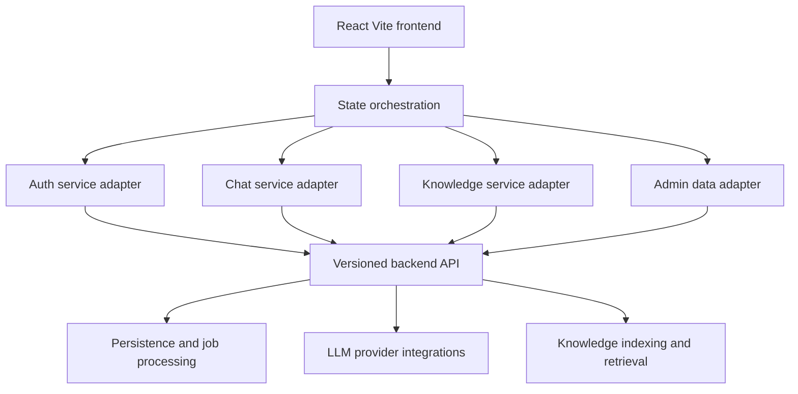

# Dominic System Plan

## System Overview

Dominic is a chat-oriented AI workspace composed of a React and Vite frontend in [`chatbot-ui/`](chatbot-ui), backed by an inferred API platform that provides authentication, chat orchestration, session persistence, retrieval-enabled knowledge management, and administrative analytics. The repository currently contains the frontend application, but its service layer and documentation clearly indicate integration with an external backend deployed separately.

At runtime, the frontend acts as a stateful client for four major domains:
- authentication and session recovery
- conversational chat and session history
- knowledge ingestion, retrieval, and document operations
- administrative controls and reporting

The current frontend architecture suggests a backend that exposes versioned REST APIs under [`API_PREFIX`](chatbot-ui/src/service/apiClient.js:6) with streaming chat support, token refresh, knowledge document pipelines, and admin endpoints.

## Architecture Summary

### Frontend

The frontend application lives in [`chatbot-ui/`](chatbot-ui) and is built with React, Vite, Axios, and Playwright.

Primary frontend responsibilities:
- manage application state in [`App`](chatbot-ui/src/App.jsx:1)
- render the layout shell in [`App()`](chatbot-ui/src/components/App/App.jsx:4)
- persist theme and selected chat model in browser storage
- handle auth token and refresh token lifecycle through [`apiClient`](chatbot-ui/src/service/apiClient.js)
- coordinate chat, knowledge, and admin flows through domain service modules
- validate critical user journeys through end-to-end tests in [`chatbot-ui/tests/e2e/`](chatbot-ui/tests/e2e)

Frontend architectural layers:
- presentation layer: component modules under [`chatbot-ui/src/components/`](chatbot-ui/src/components)
- orchestration layer: stateful container in [`chatbot-ui/src/App.jsx`](chatbot-ui/src/App.jsx)
- configuration layer: model and UI behavior in [`chatbot-ui/src/config/uiConfig.js`](chatbot-ui/src/config/uiConfig.js)
- integration layer: API adapters under [`chatbot-ui/src/service/`](chatbot-ui/src/service)

### Backend

The backend is not present in this repository, but the frontend strongly implies a separate service with these responsibilities:
- issue and refresh access credentials through auth endpoints
- persist users, roles, sessions, and messages
- execute chat requests against one or more LLM providers
- support server-sent event streaming for chat responses
- manage knowledge documents, chunking, indexing, jobs, and search
- expose admin analytics, audit logs, and cost reporting

Inferred backend domains from frontend API usage:
- auth domain via [`authApi`](chatbot-ui/src/service/authApi.js:1)
- chat domain via [`chatApi`](chatbot-ui/src/service/chatApi.js:1)
- knowledge and admin domain via [`knowledgeApi`](chatbot-ui/src/service/knowledgeApi.js:1)

### Integration

Integration between frontend and backend is centered on versioned HTTP APIs and browser-managed session state.

Integration characteristics:
- base URL configured through environment variables in [`resolveBaseUrl()`](chatbot-ui/src/service/apiClient.js:8)
- API namespace standardized by [`API_PREFIX`](chatbot-ui/src/service/apiClient.js:6)
- bearer authentication and refresh-token retry managed in [`apiClient.interceptors.response.use()`](chatbot-ui/src/service/apiClient.js:148)
- non-streaming requests handled through Axios service functions
- streaming chat handled through [`sendChatMessageStream()`](chatbot-ui/src/service/chatApi.js:175) with server-sent events
- session-scoped knowledge operations supported by document upload and ingest parameters in [`uploadKnowledgeFile()`](chatbot-ui/src/service/knowledgeApi.js:3) and [`ingestKnowledgeText()`](chatbot-ui/src/service/knowledgeApi.js:17)

## Feature Breakdown

### 1. Authentication and Identity

Observed capabilities:
- register user account
- login with username and password
- fetch current user profile
- logout and clear session
- refresh access token using stored refresh token
- change password and reset password
- admin-triggered password reset and role assignment
- user listing for administration

Primary files:
- [`chatbot-ui/src/service/authApi.js`](chatbot-ui/src/service/authApi.js)
- [`chatbot-ui/src/service/apiClient.js`](chatbot-ui/src/service/apiClient.js)
- [`chatbot-ui/src/App.jsx`](chatbot-ui/src/App.jsx)
- [`chatbot-ui/src/components/Login/Login.jsx`](chatbot-ui/src/components/Login/Login.jsx)

### 2. Chat and Session Management

Observed capabilities:
- create, list, select, and delete chat sessions
- retrieve paginated message history for sessions
- submit chat prompts with model and reasoning controls
- stream assistant responses over server-sent events
- include image inputs in chat payloads
- track usage metrics for the signed-in user
- preserve selected model and thinking effort in browser state

Primary files:
- [`chatbot-ui/src/service/chatApi.js`](chatbot-ui/src/service/chatApi.js)
- [`chatbot-ui/src/App.jsx`](chatbot-ui/src/App.jsx)
- [`chatbot-ui/src/components/ChatInput/ChatInput.jsx`](chatbot-ui/src/components/ChatInput/ChatInput.jsx)
- [`chatbot-ui/src/components/ChatWindow/ChatWindow.jsx`](chatbot-ui/src/components/ChatWindow/ChatWindow.jsx)
- [`chatbot-ui/src/components/Sidebar/Sidebar.jsx`](chatbot-ui/src/components/Sidebar/Sidebar.jsx)
- [`chatbot-ui/src/config/uiConfig.js`](chatbot-ui/src/config/uiConfig.js)

### 3. Knowledge Management and Retrieval

Observed capabilities:
- upload knowledge files
- ingest raw text as documents
- scope knowledge to a session or global space
- list documents with filtering
- inspect chunks and ingestion jobs
- search indexed knowledge chunks
- reindex or delete documents
- support async indexing jobs with polling behavior
- attach retrieval context back into chat flows

Primary files:
- [`chatbot-ui/src/service/knowledgeApi.js`](chatbot-ui/src/service/knowledgeApi.js)
- [`chatbot-ui/src/components/KnowledgePanel/KnowledgePanel.jsx`](chatbot-ui/src/components/KnowledgePanel/KnowledgePanel.jsx)
- [`chatbot-ui/src/components/ChatInput/ChatInput.jsx`](chatbot-ui/src/components/ChatInput/ChatInput.jsx)
- [`chatbot-ui/src/App.jsx`](chatbot-ui/src/App.jsx)

### 4. Administration and Observability

Observed capabilities:
- view users
- set user role
- inspect knowledge analytics
- inspect audit logs
- inspect cost metrics
- support admin panel routing within the main application shell

Primary files:
- [`chatbot-ui/src/components/AdminPanel/AdminPanel.jsx`](chatbot-ui/src/components/AdminPanel/AdminPanel.jsx)
- [`chatbot-ui/src/service/authApi.js`](chatbot-ui/src/service/authApi.js)
- [`chatbot-ui/src/service/knowledgeApi.js`](chatbot-ui/src/service/knowledgeApi.js)
- [`chatbot-ui/src/App.jsx`](chatbot-ui/src/App.jsx)

### 5. Testing and Delivery

Observed capabilities:
- build and lint through npm scripts in [`chatbot-ui/package.json`](chatbot-ui/package.json)
- browser-layer end-to-end smoke coverage using Playwright mocks in [`chatbot-ui/tests/e2e/`](chatbot-ui/tests/e2e)
- containerized static deployment via [`chatbot-ui/Dockerfile`](chatbot-ui/Dockerfile) and [`chatbot-ui/nginx.conf`](chatbot-ui/nginx.conf)

## Implementation Phases

### Phase 1: Platform and Runtime Baseline
- confirm environment configuration and API base URL handling
- validate frontend build, lint, and E2E harness readiness
- document domain boundaries between frontend and backend
- align versioned endpoint contracts and auth expectations

### Phase 2: Authentication Foundation
- stabilize register, login, logout, token refresh, and current-user flows
- confirm local storage contract and unauthorized retry behavior
- align backend auth responses with frontend session persistence requirements
- verify admin identity and role-management entry points

### Phase 3: Core Chat Experience
- harden session lifecycle and message history pagination
- validate streaming assistant responses and error handling
- confirm model catalog alignment between UI configuration and backend support
- verify chat payload support for reasoning effort, web search, and image inputs

### Phase 4: Knowledge and Retrieval Workflows
- complete document upload and raw-text ingest workflows
- validate indexing job lifecycle and chunk inspection
- align retrieval search behavior with chat session scoping
- verify reindex and delete operations, including failure feedback paths

### Phase 5: Admin and Reporting Surface
- validate user-management actions and admin-only access control
- confirm analytics, audit logs, and cost metrics data contracts
- define operational safeguards for privileged actions

### Phase 6: Quality, Deployment, and Documentation
- extend automated coverage for changed user journeys
- reconcile lint issues and repository hygiene gaps
- verify deployment configuration for local, Docker, and hosted environments
- keep architecture and task documentation synchronized with delivered behavior

## Architectural Risks and Constraints

- The repository contains only the frontend, so backend contracts are partially inferred and may drift from actual implementation.
- [`chatbot-ui/src/App.jsx`](chatbot-ui/src/App.jsx) is a very large orchestration file, which increases coupling across auth, chat, knowledge, and admin concerns.
- Streaming chat uses both Axios and Fetch-based pathways, which can cause divergence in auth, retry, and error handling semantics.
- Build-time configuration of [`VITE_API_BASE_URL`](chatbot-ui/.env.example) means environment changes require rebuild and redeploy.
- Existing lint issues noted in [`README.md`](README.md) indicate baseline quality debt that may block clean delivery pipelines.
- Frontend test coverage relies on mocked APIs, so contract mismatches with the real backend remain a delivery risk.
